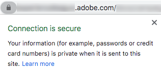
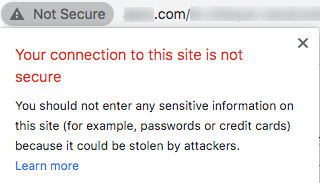

# SSL-Zertifikatanforderungsvorgang

Nachdem Sie eine Domäne für den E-Mail-Versand an Adobe delegiert haben (siehe [Domain name setup](/help/additional-resources/ac-domain-name-setup.md)), erstellt und verwendet Adobe bestimmte Subdomains für bestimmte Funktionen.

Wenn Sie beispielsweise *email.example.com* an die Adobe zum Senden von E-Mails delegiert haben, erstellt Adobe Subdomains wie die folgenden:
* *t.email.example.com*  - für Tracking-Links
* *m.email.example.com*  - für Mirrorseiten
* *res.email.example.com*  - für gehostete Ressourcen (z. B. Bilder)

Es wird empfohlen, **diese Domänen über SSL (HTTPS)** zu sichern. Ungesicherte Links (HTTP) sind anfällig für Abfangen und werden Warnhinweise auf modernen Browsern anzeigen.

Um SSL-Zertifikate auf diesen Subdomains zu installieren, müssen Sie eine CSR-Datei anfordern und anschließend SSL-Zertifikate erwerben, damit die Adobe installiert oder erneuert werden kann.

>[!CAUTION]
>
>Stellen Sie vor der Installation eines SSL-Zertifikats sicher, dass Sie die auf [dieser Seite](://experienceleague.adobe.com/docs/control-panel/using/subdomains-and-certificates/renewing-subdomain-certificate.html?lang=de#installing-ssl-certificate) aufgeführten Voraussetzungen kennen.
>
>Adobe unterstützt nur bis zu 2048-Bit-Zertifikate. 4096-Bit-Zertifikate werden noch nicht unterstützt.

## Glossar

| Begriff | Beschreibung |
|--- |--- |
| CA (Zertifizierungsstelle) | Ein SSL-Zertifikatanbieter, der Organisationen oder Einzelpersonen digitale Zertifikate nach der Überprüfung ihrer Identität ausstellt, z. B. DigiCert, Symantec usw.<ul><li>Eine vertrauenswürdige Zertifizierungsstelle wird normalerweise als Zertifizierungsstelle eines Drittanbieters betrachtet, die ein Stammzertifikat ausstellt.</li><li>Wenn das Zertifikat von derselben Organisation/Firma signiert wird, die das Zertifikat verwendet, wird es auch dann als nicht vertrauenswürdige Zertifizierungsstelle klassifiziert, wenn es sich um SSL-Zertifikate handelt, z. B. selbstsignierte Zertifikate.</li></ul> |
| Kettenzertifikat | Ein Zertifikat, das ein Stammzertifikat und ein oder mehrere Zwischenzertifikate enthält, wird als Kettenzertifikat (oder verkettetes Zertifikat) bezeichnet. |
| CSR (Certificate Signing Request) | Ein Block kodierten Texts, der einer Zertifizierungsstelle bei der Beantragung eines SSL-Zertifikats zugewiesen wird. Sie wird normalerweise auf dem Server generiert, auf dem das Zertifikat installiert ist. |
| DER (Distinguished Encoding Rules) | Ein Zertifikaterweiterungstyp. Die Erweiterung .der wird für binäre DER-kodierte Zertifikate verwendet. Diese Dateien unterstützen möglicherweise auch die Erweiterung .cer oder .crt . |
| EV-Zertifikat (Extended Validation) | Ein EV-Zertifikat ist ein neuer Zertifikatstyp, der zur Vermeidung von Phishing-Angriffen entwickelt wurde. Dies erfordert eine erweiterte Validierung Ihres Unternehmens und der Person, die das Zertifikat bestellt. |
| Zuverlässigkeitsbescheinigung | Die Zertifizierungsstelle stellt nach der Überprüfung des Eigentums an dem Domänennamen und der gültigen Geschäftsregistrierung hohe Sicherheitszertifikate aus. |
| Vermittelnder Zentralverwahrer | Eine Zertifizierungsstelle für Zwischenbescheinigungen, die in einem Kettenzeugnis enthalten sind. |
| Zwischenzertifikat | Eine Zertifizierungsstelle stellt Zertifikate in Form einer Baumstruktur aus. Das Stammzertifikat ist das oberste Zertifikat des Baums. Jedes Zertifikat zwischen Ihrem Zertifikat und dem Stammzertifikat wird als Kette- oder Zwischenzertifikat bezeichnet. |
| Geringe Zuverlässigkeitsbescheinigung | Ein Zertifikat mit geringer Sicherheit, auch als domänenvalidiertes Zertifikat bezeichnet, enthält nur den Domänennamen im Zertifikat (und nicht den Unternehmens-/Geschäftsnamen). |
| PEM (Privacy Enhanced Mail) | Ein Zertifikat mit der Erweiterung .pem , das ASCII-Daten (Base64) enthält. Solche Zertifikate beginnen mit der Zeile &quot;- - - - - BEGIN CERTIFICATE - - - -&quot;. |
| Stammzertifikat | Eine Zertifizierungsstelle stellt Zertifikate in Form einer Baumstruktur aus. Das Stammzertifikat ist das oberste Zertifikat des Baums. |
| SAN (Subject Alternative Name) | Die alternativen Namen des Betreffs sind zusätzliche Hostnamen (Sites, IP-Adressen, allgemeine Namen usw.) , die als Teil eines einzelnen SSL-Zertifikats signiert werden sollen. |
| Selbstsigniertes Zertifikat | Ein Zertifikat, das von der Person, die es erstellt, und nicht von einer vertrauenswürdigen Zertifizierungsstelle signiert wird. Selbstsignierte Zertifikate können dasselbe Verschlüsselungsniveau wie ein von einer Zertifizierungsstelle signiertes Zertifikat ermöglichen, es gibt jedoch zwei wesentliche Nachteile:<ul><li>Die Verbindung eines Besuchers kann gekapselt werden, sodass ein Angreifer alle gesendeten Daten anzeigen kann (wodurch der Zweck der Verschlüsselung der Verbindung zunichte gemacht wird).</li><li> Das Zertifikat kann nicht wie ein vertrauenswürdiges Zertifikat widerrufen werden.</li></ul> |
| SSL (Secure Sockets Layer) | Die standardmäßige Sicherheitstechnologie zum Einrichten einer verschlüsselten Verbindung zwischen einem Webserver und einem Browser. |
| Wildcard-Zertifikat | Ein Platzhalterzertifikat kann eine unbegrenzte Anzahl von Subdomains der ersten Ebene mit einem einzigen Domänennamen sichern, z. B. *.adobe.com. |

## Wichtigste Schritte

1. Bitten Sie um eine Datei mit einer Certificate Signing Request (CSR) und geben Sie die erforderlichen Informationen ein (Land, Bundesland, Stadt, Organisationsname, Name der Organisationseinheit usw.). in die Adobe.
1. Überprüfen Sie die von Adobe generierte CSR-Datei und stellen Sie sicher, dass alle von Ihnen bereitgestellten Informationen korrekt sind.
1. Verwenden Sie die CSR-Details, um ein von einer vertrauenswürdigen Zertifizierungsstelle signiertes Zertifikat zu generieren<!--taking care of asking for using the subjectAltName SSL extension (SAN) if it is for several domain names, and get/purchase the resulting certificate (ideally) in PEM format for Apache server-->.
1. Validieren Sie das SSL-Zertifikat und überprüfen Sie, ob es mit dem CSR übereinstimmt.
1. Stellen Sie das SSL-Zertifikat für Adobe bereit, die es installieren wird.
1. Testen Sie, ob das SSL-Zertifikat für jede gesicherte Subdomain erfolgreich installiert wurde.
1. Überwachen Sie den Gültigkeitszeitraum des SSL-Zertifikats.
1. Aktualisieren Sie eine bestimmte Konfiguration in Adobe Campaign.

## Detaillierter Prozess

### Voraussetzungen

Sie müssen die Domänennamen und Funktionen (Tracking, Mirrorseiten, Webapps usw.) identifizieren. zu sichern.
>[!NOTE]
>
>Adobe kann bei der Definition der Domänennamen und Funktionen helfen, die einbezogen werden sollen. Weitere Informationen erhalten Sie von Ihrem Adobe Customer Success Manager.

### Schritt 1: CSR-Datei abrufen

Gehen Sie wie folgt vor, um eine CSR-Datei (Certificate Signing Request) zu erhalten.

* Wenn Sie Zugriff auf das [Control Panel](https://experienceleague.adobe.com/docs/control-panel/using/control-panel-home.html?lang=de) haben, befolgen Sie die Anweisungen auf [dieser Seite](https://experienceleague.adobe.com/docs/control-panel/using/subdomains-and-certificates/renewing-subdomain-certificate.html#subdomains-and-certificates), um eine CSR-Datei aus dem Control Panel zu generieren und herunterzuladen.

* Erstellen Sie andernfalls ein Support-Ticket über https://adminconsole.adobe.com/ , um eine CSR-Datei von der Adobe-Kundenunterstützung für die erforderlichen Subdomains zu erhalten.

Im Folgenden finden Sie einige Best Practices für :

* Anfrage pro zugewiesener Subdomain auslösen.
* Es ist möglich, mehrere Subdomains zu einer CSR-Anfrage zu kombinieren, jedoch nur innerhalb derselben Umgebung. In Campaign Classic sind beispielsweise der Marketing-Server, der [Mid-Sourcing-Server](https://experienceleague.adobe.com/docs/campaign-classic/using/installing-campaign-classic/install-campaign-on-prem/mid-sourcing-server.html) und die [Ausführungsinstanz](https://experienceleague.adobe.com/docs/campaign-classic/using/transactional-messaging/configure-transactional-messaging/configuring-instances.html#execution-instance) drei separate Umgebungen.
* Sie müssen eine neue CSR vor einer Verlängerung eines SSL-Zertifikats erhalten. Verwenden Sie keine alte CSR-Datei von vor einem Jahr oder länger.

Sie müssen die folgenden Informationen angeben.

>[!CAUTION]
>
>Alle in den Tabellen unten angegebenen Felder müssen ausgefüllt werden. Andernfalls kann die CSR-Anfrage nicht verarbeitet werden.

**Informationen, die das Adobe-Team unterstützen sollen:**

| Zu liefernde Informationen | Beispielwert | Hinweis |
|--- |--- |--- |
| Clientname | My Company Inc. | Name Ihrer Organisation Dieses Feld wird von Adobe zum Tracking Ihrer Anfrage verwendet (es ist nicht Teil des CSR/SSL-Zertifikats). |
| Adobe Campaign-Umgebungs-URL | https://client-mid-prod1.campaign.adobe.com | Adobe Campaign-Instanz-URL. |
| Gebrauchsname [CN] | t.subdomain.customer.com | Dabei kann es sich um eine beliebige der relevanten Domänen handeln, normalerweise jedoch um die Tracking-Domäne. |
| Alternativer Betreffname [SAN] | t.subdomain.customer.com | Stellen Sie sicher, dass Sie Tracking-Subdomain als SAN einbeziehen. |
| Alternativer Betreffname [SAN] | m.subdomain.customer.com |
| Alternativer Betreffname [SAN] | res.subdomain.customer.com |

**Informationen, die von Ihrem internen IT/SSL-Team bereitgestellt werden sollen:**

| Zu liefernde Informationen | Beispielwert | Hinweis |
|--- |--- |--- |
| Land [C] | USA | Hierbei muss es sich um einen aus zwei Buchstaben bestehenden Code handeln. Rufen Sie die vollständige Länderliste [hier](https://www.ssl.com/csrs/country_codes/) auf. *Hinweis: Verwenden Sie für Großbritannien GB (nicht UK).* |
| Bundesland (oder Provinz-Name) [ST] | Illinois | Falls zutreffend. Der Wert muss ein vollständiger Name sein, nicht abgekürzt. |
| Stadt-/Ortsname [L] | Chicago |
| Organisationsname [O] | ACME |
| Name der Organisationseinheit [OU] | IT |

>[!NOTE]
>
>Ersetzen Sie &quot;subdomain.customer.com&quot;durch Ihre zugewiesene Subdomäne und die anderen Beispielwerte durch die entsprechenden Werte.

### Schritt 2: Validieren der CSR-Datei

Nachdem Sie Ihre Anfrage mit den entsprechenden Informationen gesendet haben, generiert Adobe eine CSR-Datei (Certificate Signing Request) und stellt diese bereit.

Der Text in der resultierenden CSR-Datei muss mit **&quot;—BEGIN CERTIFICATE REQUEST—&quot;** beginnen.

Nachdem Sie die CSR-Datei von Adobe erhalten haben, führen Sie die folgenden Schritte aus:

1. Kopieren Sie den CSR-Dateitext und fügen Sie ihn in einen Online-Decoder wie https://www.sslshopper.com/csr-decoder.html, <!--https://www.certlogik.com/decoder/,--> oder https://www.entrust.net/ssl-technical/csr-viewer.cfm ein.
Alternativ können Sie den Befehl *OpenSSL* lokal auf einem Linux-Computer verwenden. Weitere Informationen hierzu finden Sie auf [dieser externen Seite](https://www.question-defense.com/2009/09/22/use-openssl-to-verify-the-contents-of-a-csr-before-submitting-for-a-ssl-certificate).
1. Überprüfen Sie, ob alle Prüfungen erfolgreich sind.
1. Überprüfen Sie, ob die richtigen Parameter und Domänennamen enthalten sind.
1. Überprüfen Sie, ob alle anderen Daten mit den Details übereinstimmen, die Sie beim Senden Ihrer Anfrage angegeben haben.

### Schritt 3: Generieren des SSL-Zertifikats

Nachdem die CSR-Datei bereitgestellt wurde, müssen Sie mithilfe der CSR-Datei ein SSL-Zertifikat für die entsprechenden Domänen erwerben und generieren.

* Das SSL-Zertifikat:
   * muss im Apache PEM-Format vorliegen;
   * darf nicht länger als 2048 Bit sein;
   * muss von einer gültigen Zertifizierungsstelle (Zertifizierungsstelle) unterzeichnet werden;
   * muss alle SANs (Subject Alternative Names) enthalten, wie in der CSR-Datei erwähnt.
* Wenn ein oder mehrere Zwischenzertifikate vorhanden sind, müssen Sie das Stammzertifikat und alle Zwischenzertifikate zur Adobe bereitstellen.
* Sie können einen beliebigen Zertifikatgültigkeitszeitraum festlegen. Adobe empfiehlt jedoch, diesen ausreichend lang auszuwählen (z. B. zwei Jahre).

>[!NOTE]
>
>Wenn Sie Ihre eigenen internen Tools oder ein von einer Zertifizierungsstelle bereitgestelltes Portal verwenden, um das Zertifikat anzufordern, stellen Sie sicher, dass Sie dieselben Details wie in der CSR-Anfrage verwenden, um Verzögerungen oder Diskrepanzen beim Zertifikatgenerierungsprozess zu vermeiden.

### Schritt 4: Überprüfen des SSL-Zertifikats

Nachdem das SSL-Zertifikat generiert wurde, müssen Sie es validieren, bevor Sie es an Adobe senden. Gehen Sie dazu wie folgt vor:

1. Stellen Sie sicher, dass das Zertifikat die Erweiterung .pem aufweist. Ist dies nicht der Fall, konvertieren Sie es in das PEM-Format. Sie können die Konvertierung mit *OpenSSL* vornehmen.
1. Vergewissern Sie sich, dass das Zertifikat mit **&quot;—BEGIN CERTIFICATE—&quot;** beginnt.
1. Kopieren Sie den Zertifikattext in einen Online-Decoder, z. B. https://www.sslshopper.com/certificate-decoder.html oder https://www.entrust.net/ssl-technical/csr-viewer.cfm.
Alternativ können Sie den Befehl *OpenSSL* lokal auf einem Linux-Computer verwenden. Weitere Informationen hierzu finden Sie auf [dieser externen Seite](https://www.shellhacks.com/decode-ssl-certificate/).
1. Stellen Sie sicher, dass das Zertifikat ordnungsgemäß aufgelöst wurde, einschließlich des allgemeinen Namens, SAN, Ausstellers und Gültigkeitszeitraums.
1. Wenn die SSL-Zertifikatüberprüfung erfolgreich ist, überprüfen Sie mithilfe von [dieser Website](https://www.sslshopper.com/certificate-key-matcher.html), ob das Zertifikat mit der CSR übereinstimmt: Wählen Sie **Überprüfen Sie, ob eine CSR und ein Zertifikat mit** übereinstimmen, und geben Sie Ihr Zertifikat und Ihre CSR in die entsprechenden Felder ein. Sie sollten übereinstimmen.

### Schritt 5: Anfordern der Installation des SSL-Zertifikats

* Wenn Sie Zugriff auf das [Control Panel](https://experienceleague.adobe.com/docs/control-panel/using/control-panel-home.html) haben, befolgen Sie die Anweisungen auf [dieser Seite](https://experienceleague.adobe.com/docs/control-panel/using/subdomains-and-certificates/renewing-subdomain-certificate.html#installing-ssl-certificate), um das Zertifikat in das Control Panel hochzuladen.

* Erstellen Sie andernfalls ein weiteres Support-Ticket über https://adminconsole.adobe.com/ , um die Adobe zur Installation des Zertifikats auf den Adobe-Servern anzufordern.

Sie müssen Folgendes bereitstellen:

* Die Zertifikatdatei, das Stammzertifikat und alle Zwischenzertifikate (an das Ticket angehängt), vorzugsweise im Apache PEM-Format.
* Die Nummer des vorherigen Support-Tickets, das für die CSR erhöht wurde.
* Dieselben Daten, die für das CSR-Ticket bereitgestellt wurden (einschließlich Allgemeiner Name, Instanz-URL, Bundesland, Stadt/Ort, Organisationsname, Name der Organisationseinheit usw.).

### Schritt 6: Installieren des SSL-Zertifikats testen

Nachdem das SSL-Zertifikat installiert und von der Adobe-Kundenunterstützung bestätigt wurde, stellen Sie sicher, dass es für alle URLs erfolgreich installiert wurde.

Führen Sie die folgenden Tests durch, bevor Sie das SSL-Installationticket schließen. Achten Sie außerdem darauf, alle spezifischen Konfigurationen zu aktualisieren, wie in [diesem Abschnitt](#update-configuration) beschrieben.

Navigieren Sie zu den folgenden URLs in Ihrem Browser (ersetzen Sie &quot;subdomain.customer.com&quot;durch Ihre Subdomain):

* https://subdomain.customer.com/r/test (nur für [Webanwendungen](https://experienceleague.adobe.com/docs/campaign-classic/using/designing-content/web-applications/about-web-applications.html) -Subdomains - gilt nicht für E-Mail-Subdomains)
* https://t.subdomain.customer.com/r/test
* https://m.subdomain.customer.com/r/test
* https://res.subdomain.customer.com/r/test

Ein erfolgreiches Ergebnis liefert Umgebungsinformationen, und die Adressleiste in der URL zeigt an, dass die Verbindung sicher ist. Sie können beispielsweise die folgende Meldung in Google Chrome sehen:

Wenn das SSL-Zertifikat nicht ordnungsgemäß installiert ist, wird die folgende Warnung angezeigt:

### 7. Schritt - Prüfung des Gültigkeitszeitraums des Zertifikats

Sie können die Gültigkeitsdauer des Zertifikats in Ihrem Browser überprüfen. Klicken Sie beispielsweise in Google Chrome auf **Secure** > **Certificate**.

Es liegt in Ihrer Verantwortung, den Gültigkeitszeitraum zu überprüfen. Adobe empfiehlt die Implementierung eines Prozesses zur Überwachung des Ablaufs von Zertifikaten. Weitere Informationen dazu, was passiert, wenn Ihr SSL-Zertifikat abläuft, finden Sie in [diesem Artikel](https://www.thesslstore.com/blog/what-happens-when-your-ssl-certificate-expires/).

* Erstellen Sie ein Support-Ticket, um ein aktualisiertes Zertifikat mindestens zwei Wochen vor dem Ablaufdatum des Zertifikats anzufordern. Sie müssen keine zusätzliche CSR anfordern, es sei denn, die CSR-Details wurden geändert.

* Wenn Sie Zugriff auf das [Control Panel](https://experienceleague.adobe.com/docs/control-panel/using/control-panel-home.html) haben und Ihre Umgebung in einer AWS-Umgebung von Adobe gehostet wird, können Sie das Control Panel verwenden, um das Zertifikat zu verlängern, bevor es abläuft. Weiterführende Informationen finden Sie in diesem [Abschnitt](https://experienceleague.adobe.com/docs/control-panel/using/subdomains-and-certificates/monitoring-ssl-certificates.html#monitoring-certificates).

### Schritt 8: Aktualisieren einer bestimmten Konfiguration {#update-configuration}

Sobald Sie sicher sind, dass die angeforderten SSL-Zertifikate ordnungsgemäß installiert sind, können Sie alle Verweise in Adobe Campaign von HTTP auf HTTPS aktualisieren.

>[!NOTE]
>
>Die zu aktualisierenden URLs befinden sich zum Campaign Classic hauptsächlich im [Softwareverteilungs-Assistenten](https://experienceleague.adobe.com/docs/campaign-classic/using/installing-campaign-classic/initial-configuration/deploying-an-instance.html#deployment-wizard) und im [Externe Konten](https://experienceleague.adobe.com/docs/campaign-classic/using/installing-campaign-classic/accessing-external-database/external-accounts.html) (Tracking-, Mirrorseite- und Public-Resource-Domänen). Campaign Standard: Siehe [Branding configuration](https://experienceleague.adobe.com/docs/campaign-standard/using/administrating/application-settings/branding.html#about-brand-identity).

Nach der Aktualisierung der Konfigurationen werden neue E-Mails mit HTTPS-URLs und nicht mit HTTP gesendet. Um zu überprüfen, ob die URLs jetzt sicher sind, können Sie schnell die folgenden Tests durchführen:

* Laden Sie ein Bild aus Adobe Campaign hoch. Nach dem Hochladen des Bildes sollte die zurückgegebene URL HTTPS sein.
* Erstellen Sie einen Test-E-Mail-Versand mit einem Mirrorseiten-Link, einigen Bildern, Text und einem Abmelde-Link. Senden Sie die E-Mail an eine externe E-Mail-ID (z. B. Ihre Gmail-Adresse). Öffnen Sie nach dem Erhalt die E-Mail und stellen Sie sicher, dass alle Links in der E-Mail im HTTPS-Formular (nicht im HTTP-Format) korrekt geöffnet werden, ohne dass SSL-Zertifikatwarnungen oder -Fehler auftreten.

## Produktspezifische Ressourcen

**Campaign Classic**

* [Control Panel: Hinzufügen von SSL-Zertifikaten (Tutorial)](https://experienceleague.adobe.com/docs/campaign-classic-learn/control-panel/subdomains-and-certificates/adding-ssl-certificates.html)  - Erfahren Sie, wie Sie SSL-Zertifikate hinzufügen, um Ihre Subdomains zu schützen.

**Campaign Standard**

* [Control Panel: Hinzufügen von SSL-Zertifikaten (Tutorial)](https://experienceleague.adobe.com/docs/campaign-standard-learn/control-panel/subdomains-and-certificates/adding-ssl-certificates.html)  - Erfahren Sie, wie Sie SSL-Zertifikate hinzufügen, um Ihre Subdomains zu schützen.
