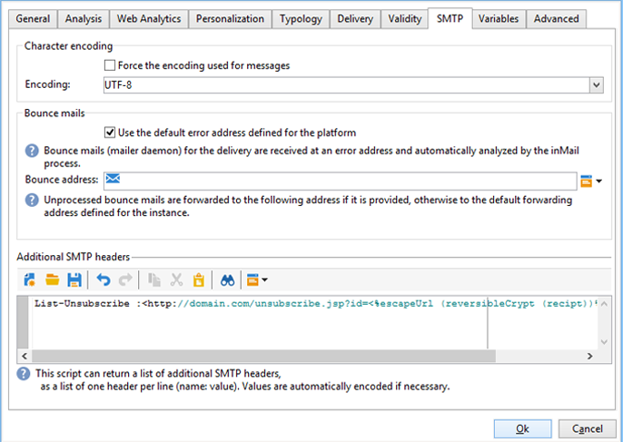

# Campaign Classic – Technische Empfehlungen {#technical-recommendations}

Nachfolgend sind verschiedene Techniken, Konfigurationen und Tools aufgeführt, mit denen Sie Ihre Zustellrate bei Verwendung von Adobe Campaign Classic verbessern können.

## Konfiguration {#configuration}

### Reverse DNS {#reverse-dns}

: Adobe Campaign prüft, ob für eine IP-Adresse ein Reverse-DNS angegeben ist und ob dieses wirklich auf die IP-Adresse zurückverweist.

Bei der Netzwerkkonfiguration ist es wichtig sicherzustellen, dass für jede der für ausgehende Nachrichten bestimmten IP-Adressen ein korrektes Reverse-DNS angegeben ist. Für eine bestimmte IP-Adresse existiert also ein Reverse-DNS Datensatz (PTR-Datensatz) mit einem passenden DNS (Datensatz), das auf die ursprüngliche IP zurückverweist.

Die Wahl der Domain für ein Reverse DNS hat Auswirkungen auf den Umgang mit bestimmten ISPs. Insbesondere AOL akzeptiert nur Feedback-Schleifen mit einer Adresse in derselben Domain wie das Reverse DNS (siehe [Feedback Loop](#feedback-loop)).

>[!NOTE]
>
>Sie können [dieses externe Tool](https://mxtoolbox.com/SuperTool.aspx) verwenden, um die Konfiguration einer Domäne zu überprüfen.

### MX-Regeln {#mx-rules}

MX-Regeln (Mail eXchanger) dienen zur Verwaltung der Kommunikation zwischen einem Sender- und einem Empfangs-Server.

Genauer gesagt werden sie verwendet, um die Geschwindigkeit zu steuern, mit der der Adobe Campaign MTA (Message Transfer Agent) E-Mails an jede E-Mail-Domain oder jeden ISP sendet (z. B. hotmail.com, comcast.net). Diese Regeln basieren in der Regel auf Beschränkungen, die von den ISPs veröffentlicht werden (z. B. nicht mehr als 20 Nachrichten pro SMTP-Verbindung).

>[!NOTE]
>
>Weiterführende Informationen zur MX-Verwaltung in Adobe Campaign Classic finden Sie in [diesem Abschnitt](https://experienceleague.adobe.com/docs/campaign-classic/using/installing-campaign-classic/additional-configurations/email-deliverability.html#mx-configuration).

### TLS {#tls}

: TLS (Transport Layer Security) ist ein Verschlüsselungsprotokoll zur Sicherung der Verbindung zwischen zwei E-Mail-Servern. Damit wird sichergestellt, dass die E-Mail nur vom beabsichtigten Empfänger gelesen werden kann.

### Domain des Absenders {#sender-domain}

Um die für den HELO-Befehl verwendete Domain zu definieren, bearbeiten Sie die Konfigurationsdatei der Instanz (conf/config-instance.xml) und definieren Sie das Attribut &quot;localDomain&quot; wie folgt:

```
<serverConf>
  <shared>
    <dnsConfig localDomain="mydomain.net"/>
  </shared>
</serverConf>
```

Die Domäne MAIL FROM ist die Domäne, die in technischen Bounce Messages verwendet wird. Diese Adresse wird im Softwareverteilungs-Assistenten oder über die Option NmsEmail_DefaultErrorAddr definiert.

### SPF-Datensatz {#dns-configuration}

Ein SPF-Eintrag kann derzeit auf einem DNS-Server als TXT-Eintrag (Code 16) oder als SPF-Eintrag (Code 99) definiert werden. Ein SPF-Datensatz hat die Form einer Zeichenfolge. Beispiel:

```
v=spf1 ip4:12.34.56.78/32 ip4:12.34.56.79/32 ~all
```

definiert die beiden IP-Adressen 12.34.56.78 und 12.34.56.79 als berechtigt, E-Mails für die Domain zu senden. **~** bedeutet, dass jede andere Adresse als SoftFail interpretiert werden sollte.

Recommendations zum Definieren eines SPF-Datensatzes:

* Fügen Sie am Ende **~all** (SoftFail) oder **-all** (Fail) hinzu, um alle Server abzulehnen, die nicht definiert sind. Andernfalls können Server diese Domain (mit einer neutralen Auswertung) fälschen.
* Fügen Sie nicht **ptr** hinzu (openspf.org empfiehlt dies als kostspielig und unzuverlässig).

>[!NOTE]
>
>Weitere Informationen zu SPF finden Sie in [diesem Abschnitt](/help/additional-resources/authentication.md#spf).

## Authentifizierung

>[!NOTE]
>
>Weitere Informationen zu den verschiedenen Formen der E-Mail-Authentifizierung finden Sie in [diesem Abschnitt](/help/additional-resources/authentication.md).

### DKIM {#dkim-acc}

>[!NOTE]
>
>Bei gehosteten oder hybriden Installationen erfolgt die DKIM-E-Mail-Authentifizierungssignatur für alle Nachrichten mit allen Domains durch den Enhanced MTA, wenn Sie auf den [Enhanced MTA](https://experienceleague.adobe.com/docs/campaign-classic/using/sending-messages/sending-emails/sending-an-email/sending-with-enhanced-mta.html#sending-messages) aktualisiert haben.

Für die Verwendung von [DKIM](/help/additional-resources/authentication.md#dkim) mit Adobe Campaign Classic ist die folgende Voraussetzung erforderlich:

**Adobe Campaign-Optionsdeklaration**: in Adobe Campaign basiert der private DKIM-Schlüssel auf einem DKIM-Selektor und einer Domäne. Es ist derzeit nicht möglich, mehrere private Schlüssel für dieselbe Domäne/Subdomäne mit verschiedenen Selektoren zu erstellen. Es ist nicht möglich zu definieren, welche Selektordomäne/Subdomäne für die Authentifizierung in weder der Plattform noch der E-Mail verwendet werden muss. Die Plattform wählt alternativ einen der privaten Schlüssel aus, was bedeutet, dass die Authentifizierung mit hoher Wahrscheinlichkeit fehlschlägt.

* Wenn Sie DomainKeys für Ihre Adobe Campaign-Instanz konfiguriert haben, müssen Sie nur **dkim** in den [Domain-Verwaltungsregeln](https://experienceleague.adobe.com/docs/campaign-classic/using/sending-messages/monitoring-deliveries/understanding-delivery-failures.html#email-management-rules) auswählen. Wenn nicht, führen Sie dieselben Konfigurationsschritte (privater/öffentlicher Schlüssel) wie für DomainKeys aus (der DKIM ersetzt hat).
* Es ist nicht notwendig, sowohl DomainKeys als auch DKIM für dieselbe Domain zu aktivieren, da es sich bei DKIM um eine verbesserte Version von DomainKeys handelt.
* Folgende Domains validieren aktuell DKIM: AOL, Gmail.

## Feedback Loops {#feedback-loop-acc}

Eine Feedback-Schleife funktioniert, indem auf der ISP-Ebene eine bestimmte E-Mail-Adresse für einen Bereich von IP-Adressen angegeben wird, der zum Senden von Nachrichten verwendet wird. Der ISP wird die Nachrichten, die von Empfängern als Spam gemeldet werden, auf ähnliche Weise an diesen Posteingang senden wie bei Bounce-Nachrichten. Die Plattform sollte so konfiguriert sein, dass zukünftige Sendungen für Benutzer, die sich beschwert haben, blockiert werden. Es ist wichtig, dass sie nicht mehr kontaktiert werden, auch wenn sie nicht den richtigen Ausschluss-Link verwendet haben. Auf der Grundlage dieser Beschwerden fügt ein ISP seiner Blockierungsliste eine IP-Adresse hinzu. Je nach ISP wird eine Beschwerderate von etwa 1 % dazu führen, dass eine IP-Adresse blockiert wird.

Aktuell wird an der Konzeption eines Standards für das Format von Feedback-Loop-Nachrichten gearbeitet: das [Abuse Feedback Reporting Format (ARF)](https://tools.ietf.org/html/rfc6650).

Zur Implementierung eines Feedback Loops für eine Instanz sind folgende Elemente erforderlich:

* ein für die Instanz bestimmtes Postfach, bei dem es sich um das Bounce-Postfach handeln kann,
* für die Instanz bestimmte IP-Versandadressen.

Die Implementierung eines einfachen Feedback Loop in Adobe Campaign verwendet die Bounce-Nachrichtenfunktionalität. Das Feedback Loop-Postfach wird als ein Bounce-Postfach verwendet. Es wird eine Regel zur Erkennung dieser Nachrichten definiert. Die E-Mail-Adressen der Empfänger, die die Nachricht als Spam gemeldet haben, werden der Quarantäneliste hinzugefügt.

* Erstellen oder bearbeiten Sie im Knoten **[!UICONTROL Administration > Kampagnen > Unzustellbarkeitsverwaltung > E-Mail-Regeln]** eine Bounce-Message-Regel **Feedback_loop** und geben Sie dabei den Grund **Abgelehnt** sowie den Typ **Hard** an.
* Wenn speziell für das Feedback Loop ein Postfach definiert wurde, definieren Sie die dafür geltenden Zugriffsparameter, indem Sie unter **[!UICONTROL Administration > Plattform > Externe Konten]** ein neues externes Bounce-Message-Konto erstellen.

Der Mechanismus zur Verarbeitung von Beschwerdebenachrichtigungen ist sofort funktionstüchtig. Um die korrekte Funktionsweise der Regel sicherzustellen, können Sie die Konten zeitweise deaktivieren, damit sie diese Nachrichten nicht abrufen. Sie können die Inhalte des Feedback-Loop-Postfachs dann manuell überprüfen. Führen Sie auf dem Server die folgenden Befehle aus:

```
nlserver stop inMail@instance,
nlserver inMail -instance:instance -verbose.
```

Sollten Sie gezwungen sein, eine einzige Feedback-Loop-Adresse für mehrere Instanzen zu verwenden, müssen Sie:

* die empfangenen Nachrichten auf so vielen Postfächern replizieren wie Instanzen vorhanden sind,
* dafür sorgen, dass jedes Postfach von einer einzigen Instanz abgerufen wird,
* Konfigurieren Sie die Instanzen so, dass sie nur die Nachrichten verarbeiten, die sie betreffen: Die Instanzinformationen sind im Nachrichten-ID-Header der von Adobe Campaign gesendeten Nachrichten enthalten und befinden sich daher auch in den Feedback Loop-Nachrichten. Geben Sie einfach den Parameter **checkInstanceName** in der Konfigurationsdatei der Instanz an (standardmäßig wird die Instanz nicht überprüft, was dazu führen kann, dass bestimmte Adressen falsch unter Quarantäne gestellt werden):

   ```
   <serverConf>
     <inMail checkInstanceName="true"/>
   </serverConf>
   ```

Der Zustellbarkeitsdienst in Adobe Campaign sorgt für die Verwaltung Ihrer Anmeldung für Feedback-Loop-Dienste für die folgenden ISPs: AOL, BlueTie, Comcast, Cox, EarthLink, FastMail, Gmail, Hotmail, HostedEmail, Libero, Mail.ru, MailTrust, OpenSRS, QQ, RoadRunner, Synacor, Telenor, Terra, UnitedOnline, USA, XS4ALL, Yahoo, Yandex, Zoho.

## List-Unsubscribe {#list-unsubscribe}

### Über List-Unsubscribe {#about-list-unsubscribe}

Zur optimalen Verwaltung der Zustellbarkeit ist das Hinzufügen eines SMTP-Headers namens **List-Unsubscribe** zwingend erforderlich.

Dieser Header kann alternativ zum Symbol &quot;Als Spam melden&quot; verwendet werden. Er wird innerhalb der E-Mail in Form eines Abmelde-Links angezeigt.

Die Verwendung dieser Funktion hilft dabei, Ihren Ruf zu schützen, und das Feedback wird wie eine Abmeldung ausgeführt.

Zur Verwendung von List-Unsubscribe ist die Eingabe einer Befehlszeile notwendig, die in etwa so aussieht:

```
List-Unsubscribe: mailto: client@newsletter.example.com?subject=unsubscribe?body=unsubscribe
```

>[!CAUTION]
>
>Das oben stehende Beispiel basiert auf der Empfängertabelle. Sollte die Datenbankimplementierung über eine andere Tabelle erfolgen, stellen Sie bitte sicher, dass Sie die Befehlszeile mit den korrekten Informationen umformulieren.

Die folgende Befehlszeile kann zum Zweck der Erstellung eines dynamischen **List-Unsubscribe** verwendet werden:

```
List-Unsubscribe: mailto: %=errorAddress%?subject=unsubscribe%=message.mimeMessageId%
```

Gmail, Outlook.com und Microsoft Outlook unterstützen diese Methode und eine Abmelde-Schaltfläche ist direkt in ihrer Benutzeroberfläche verfügbar. Diese Technik senkt die Beschwerderaten.

Sie können **List-Unsubscribe** implementieren, indem Sie:

* Direktes [Hinzufügen der Befehlszeile in der Versandvorlage](#adding-a-command-line-in-a-delivery-template)
* [Erstellung einer Typologieregel](#creating-a-typology-rule)

### Hinzufügen einer Befehlszeile in einer Versandvorlage {#adding-a-command-line-in-a-delivery-template}

Die Befehlszeile muss im Zusatzabschnitt des SMTP-Headers der E-Mail hinzugefügt werden.

Das kann entweder in jeder E-Mail oder in bereits existierenden Versandvorlagen erfolgen. Sie haben außerdem die Möglichkeit, eine neue diese Funktion beinhaltende Versandvorlage zu erstellen.

### Erstellung einer Typologieregel {#creating-a-typology-rule}

Die Regel muss das Script zur Erzeugung der Befehlszeile beinhalten und im E-Mail-Header enthalten sein.

>[!NOTE]
>
>Es wird empfohlen, eine Typologieregel zu erstellen: Die List-Unsubscribe-Funktion wird automatisch zu jeder E-Mail hinzugefügt.

1. List-Unsubscribe: &lt;mailto:unsubscribe@domain.com>

   Durch die Verwendung des **unsubscribe**-Links wird das Standard-E-Mail-Programm des Benutzers geöffnet. Diese Typologieregel muss in einer zur E-Mail-Erstellung verwendeten Typologie hinzugefügt werden.

1. List-Unsubscribe: `<https://domain.com/unsubscribe.jsp>`

   Durch die Verwendung des **unsubscribe**-Links wird der Benutzer zu Ihrem Abmeldeformular weitergeleitet.

   Beispiel:

   

>[!NOTE]
>
>In [diesem Abschnitt](https://experienceleague.adobe.com/docs/campaign-classic/using/orchestrating-campaigns/campaign-optimization/about-campaign-typologies.html#typology-rules) erfahren Sie, wie Sie Typologieregeln in Adobe Campaign Classic erstellen.

## E-Mail-Optimierung {#email-optimization}

### SMTP {#smtp}

SMTP (Simple Mail Transfer Protocol) ist ein Internet-Standard für die E-Mail-Übertragung.

Die SMTP-Fehler, die nicht von einer Regel überprüft werden, sind im Ordner **[!UICONTROL Administration]** > **[!UICONTROL Kampagnenverwaltung]** > **[!UICONTROL Unzustellbarkeitsverwaltung]** > **[!UICONTROL Versandlogqualifizierung]** aufgeführt. Diese Fehlermeldungen werden standardmäßig als unerreichbare Softbounces interpretiert.

Die häufigsten Fehler müssen identifiziert und eine entsprechende Regel in **[!UICONTROL Administration]** > **[!UICONTROL Kampagnenverwaltung]** > **[!UICONTROL Unzustellbarkeitsverwaltung]** > **[!UICONTROL E-Mail-Regelsätze]** hinzugefügt werden, wenn Sie das Feedback von den SMTP-Servern richtig qualifizieren möchten. Andernfalls führt die Plattform nach einer bestimmten Anzahl von Tests unnötige Versuche durch (im Fall unbekannter Benutzer) oder platziert bestimmte Empfänger fälschlicherweise unter Quarantäne.

### Dedizierte IP-Adressen {#dedicated-ips}

Adobe bietet jedem Kunden für die Anlaufphase eine dedizierte IP-Strategie zum Aufbau der Reputation und zur Optimierung der Zustellbarkeit.
