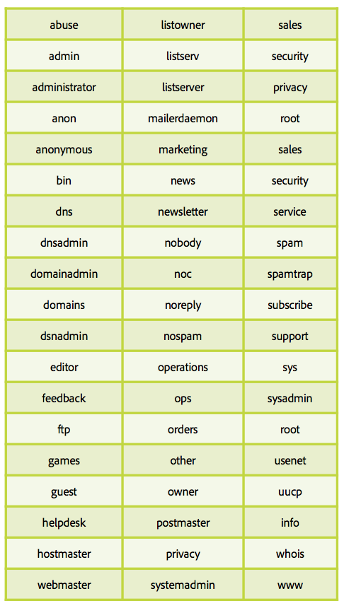
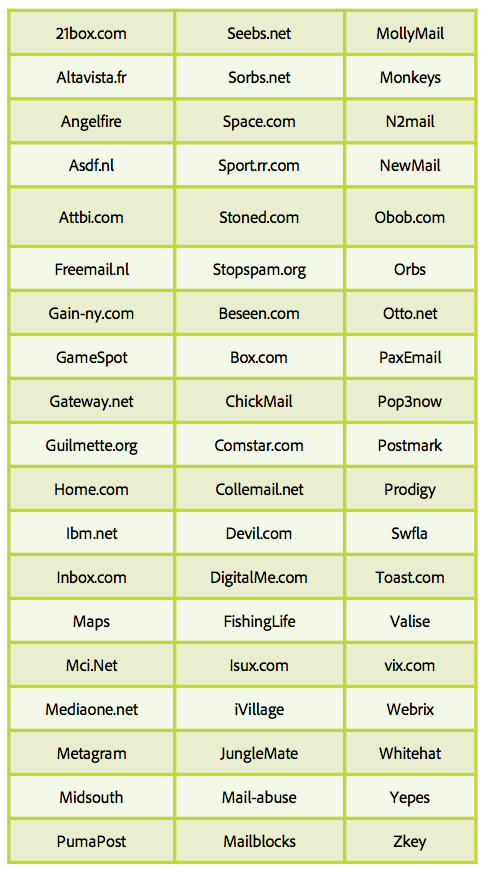

# Alles über Spam-Fallen

Eine [Spam-Falle](/help/metrics/spam-traps.md) ist eine technisch gültige Adresse, die keine Fehlermeldung auslöst, wenn E-Mails an sie gesendet werden. Die Hauptaufgabe von Spam-Fallen ist, Spammer oder Absender zu identifizieren, die über keine Verfahren zur Datenbereinigung verfügen.

## Wer verwaltet die Adressen für Spam-Fallen?

Eine Art von Spam-Fallen-Adressen basiert auf IP- und Domain-Blockierungslisten von Unternehmen wie SpamHaus, Sorbs und SpamCop. Diese Firmen besitzen ein riesiges Netzwerk von Adressen, die auf verschiedenen Internet-Seiten wie Websites, Blogs und Foren platziert werden, sodass Spammer diese Adressen sammeln.

Die andere Art von Spam-Fallen basiert auf alten aktiven ISP-Adressen. Diese ISPs haben ihr eigenes Spam-Fallen-Netzwerk, das auf inaktiven Adressen beruht, die in Fallen umgewandelt werden. Jeder Versand an diese Adresse wirkt sich negativ auf die Reputation der Absender-IP und -Domain aus.

## Funktionsweise

**Eine E-Mail-Adresse ohne Endbenutzer**: Diese Adressen haben keinen Endbenutzer, der sich für Newsletter oder andere Arten von Kommunikation registrieren könnte, und werden auch nie an einen vergeben.

**Eine von einem Benutzer nicht mehr verwendete E-Mail-Adresse**: Nach einer gewissen Zeit der Inaktivität werden Adressen von den ISPs deaktiviert. Bounce-Nachrichten werden an die Absender gesendet, um sie über diesen neuen Status zu informieren. Absender müssen diese Adressen in Quarantäne verschieben oder sie aus zukünftigen Aussendungen entfernen. ISPs verwenden diese in „Spam-Fallen“ umgewandelten Adressen, um Absender mit unzulässigen Praktiken zu überwachen.

## Wie erkennt man eine Spam-Falle?

Spam-Fallen zu identifizieren ist schwierig. Diese Adressen müssen anonym bleiben, da sie zur Identifizierung unzulässiger Absender verwendet werden. Der Großteil der ISPs verfügt über kein vollautomatisches System zur Überwachung von E-Mails von unzulässigen Absendern. Anhand von früheren Definitionen ist es jedoch möglich, eine Gruppe verdächtiger Adressen zu bestimmen und die Effizienz dieser Auswahl zu testen.

## Warum ist Ihre Datenbank mit Spam-Fallen infiziert?

Ihre Adressdatenbank enthält Spam-Fallen. Wie konnte das passieren? Die beiden Hauptgründe sind ein mangelhaftes Datenbereinigungsverfahren oder eine Fehlfunktion bei der Erfassung.

Anhand dieser Fragen können Sie Ihre Verfahren überprüfen:

* Fehlfunktion bei der Erfassung:
   * Woher kommen Ihre E-Mail-Adressen? Wie viele Quellen werden zur Erfassung dieser Adressen verwendet? Können Sie sie identifizieren? Interne/Co-Registrierung?
   * Funktioniert Ihr Opt-in-System ordnungsgemäß?
   * Haben Sie die Domains und den Alias Ihrer Adressen überprüft? Sie können dies mit der Tabelle unten tun.
* Verfahren zur Datenbereinigung:
   * Wie sieht Ihr Verfahren bei inaktiven Adressen der letzten 12 Monate aus?
   * Verhängen Sie eine Quarantäne bei Softbounces, indem Sie sie als „inaktive Benutzer“ kennzeichnen?
   * Wann haben Sie das letzte Mal Ihre Datenbank gepflegt und versucht, sie zu bereinigen? Machen Sie es regelmäßig.

## Zu vermeidende Aliase und Domains

**Aliase**

**Domains**

