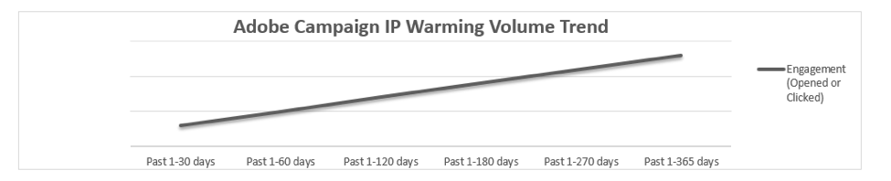

# E-Mail-Reputation mit IP-Warming verbessern

<!--Increase your email reputation with IP warming

## IP Warming overview

In the Adobe Deliverability Consulting and Deliverability Operations teams, we have a vested interest in helping new Campaign customers be as successful as possible as they embark on the route of an IP warming process. If you’ve never been a part of such a project, you may have a lot of questions about it. Let’s get down to the details!-->

## Erste Schritte

Adobe verlangt von seinen Kunden, dass sie Adobe ihre Konfiguration übermitteln, um dem Adobe Zustellbarkeitsteam zu ermöglichen, ihr individuelles Programm zu verstehen. Die von uns gestellten Fragen dienen dazu, dem Adobe Zustellbarkeitsteam Einblicke in Ihre Versandreputation und Ihr E-Mail-Volumen zu gewähren. Ohne ein konkretes Verständnis Ihres Geschäftsmodells, Ihrer E-Mail-Marketing-Ziele und Ihrer Reputationsmetriken können wir die Strategie nicht anpassen und es besteht die Gefahr von Zustellbarkeitsproblemen.

Zu Beginn werden Ihnen eigene IP-Adressen (Internet Protocol) zugewiesen. Im Zusammenhang mit dem E-Mail-Versand ist eine IP-Adresse die Route, über die Ihre E-Mail-Nachrichten an Ihre Kunden gesendet werden. IP-Adressen und Domains werden verwendet, um Absender in einem Netzwerk gegenüber den empfangenden Internet-Dienstleistern (ISP – Internet Service Provider) zu identifizieren. Adobe weist die entsprechende Anzahl dedizierter IP-Adressen für den E-Mail-Versand auf der Basis Ihres Versandvolumens, Ihrer E-Mail-Programme, Ihrer Datensegmentierungsverfahren und Ihres Vertrags zu.

**Verwandte Themen:**
* [Reibungsloser Wechsel zwischen E-Mail-Plattformen](../../help/transition-process/switching-email-platforms.md)
* [IP-Strategie](../../help/transition-process/infrastructure.md#ip-strategy)
* [ISP-spezifische Überlegungen beim IP-Warming](../../help/transition-process/isp-specific-considerations-during-ip-warming.md)

## IP-Warming: Warum macht man das? {#why-ip-warming}

ISPs oder Mailbox-Anbieter (MBP – Mailbox-Provider) ergreifen Vorsichtsmaßnahmen, wenn sie eine unbekannte IP-Adresse und sendende Domain erkennen. Dies ist ein Standardverfahren, das bei jeder neuen sendenden IP-Adresse unabhängig vom Absendertyp zur Anwendung kommt. ISPs/MBPs prüfen die IP-Adresse und die sendende Domain sehr genau, um festzustellen, ob die von dieser IP-Adresse und Domain gesendeten E-Mails Spam sind oder nicht.  Dies ist ein Standardverfahren, das bei jeder neuen sendenden IP-Adresse unabhängig vom Absendertyp zur Anwendung kommt.

ISPs untersuchen sorgfältig das Versandvolumen, die Versandhäufigkeit, Beschwerden und Bounce-Raten, die von diesen E-Mail-Sendungen verursacht werden. Diese Werte werden alle genau geprüft, weil sie Indikatoren für die Reputation des Absenders sind – egal ob sie gut oder schlecht ist.

Natürlich benötigt dieser Untersuchungsprozess dieser Datenpunkte Zeit und kann nicht in ein oder zwei Tagen durchgeführt werden. Reputation wird im Laufe der Zeit aufgebaut. Dieser Vorgang ist damit vergleichbar, einen Fremden in Ihr Haus zu lassen. Hätten Sie Bedenken, wenn jemand, den Sie nicht kennen, Ihr Haus betritt?

Sehr wahrscheinlich lautet die Antwort „ja“. Sie würden diese Person und ihre Beweggründe genauer betrachten wollen. Könnte sie Schaden anrichten? Stellt sie eine Bedrohung dar? ISPs tun dasselbe, um ihr Netzwerk vor bösartigem oder unerwünschtem Traffic zu schützen. Positive Reputationsmetriken verhelfen Ihnen zu einem erfolgreichen IP-Warming-Prozess. Deshalb betonen wir, wie wichtig es ist, mit dem Versenden kleiner E-Mail-Volumina und dem Versand an Ihre aktivsten Kunden zu beginnen. Weitere Informationen hierzu finden Sie unter [Targeting-Kriterien beim Senden von neuem Traffic](/help/transition-process/targeting-criteria.md).

Das Versenden großer Mengen von E-Mails von einer oder mehreren brandneuen IP-Adressen gleich zu Beginn ist eine schlechte Praxis und wird Ihnen wahrscheinlich einige Schwierigkeiten bei der Zustellbarkeit bereiten. Es ist wichtig zu beachten, dass, selbst wenn Sie mit dem Versenden von kleinen Volumina beginnen und diese, wie empfohlen, allmählich erhöhen, es immer noch notwendig ist, die Best Practices für E-Mails zu befolgen.

## Erlaubnis zum Senden einer E-Mail (explizites Opt-In)

Dies ist die wichtigste Komponente beim Verwalten und Vergrößern einer E-Mail-Abonnentenliste. Da Anti-Spam-Gesetze immer strikter werden und auf internationaler Ebene zunehmen, sollte ein Marketer darauf achten, die ausdrückliche Zustimmung von jedem Abonnenten in seiner Liste erhalten zu haben. Das heißt, jeder Abonnent hat aktiv zugestimmt, E-Mails von Ihrer Marke zu erhalten. Dies unterscheidet sich von der impliziten Zustimmung, bei der eine Person in eine E-Mail-Liste aufgenommen wird, nachdem sie eine Aktion durchgeführt hat, die nicht die explizite Anmeldung für ein E-Mail-Programm war.

Weitere Informationen finden Sie in den [Richtlinien von Adobe zur akzeptablen Nutzung](https://www.adobe.com/de/legal/terms/aup.html).

## Reputationsmetriken: Wonach suchen ISPs?

ISPs verwenden ausgeklügelte Technologien, um fundierte Entscheidungen darüber zu treffen, ob sie E-Mails, die sie von externen Netzwerken erhalten, zustellen sollen oder nicht. Dabei werden sie oft von komplexen proprietären Algorithmen unterstützt.

Einige der untersuchten Datenpunkte sind:

* Treffer bei Spam-Fallen
* Blockierungslisten-Treffer
* E-Mail-Bounces
* Aktivität der Abonnenten

ISPs verlangen spezifische technische Konfigurationen, die mit ihren Richtlinien und Best Practices übereinstimmen. Adobe konfiguriert Ihre IP-Adressen und delegierten Subdomains, um Sie als verantwortlichen und vertrauenswürdigen Absender zu identifizieren. Dies wird [E-Mail-Authentifizierung](/help/transition-process/infrastructure.md#authentication) genannt. Die Authentifizierung hilft den Empfängern zu überprüfen, ob ein Absender die nötigen Rechte hat, um von einer IP-Adresse oder Domain zu senden.

Die Authentifizierung ermöglicht es den ISPs festzustellen, ob ein Unternehmen, das von einer Domain oder IP-Adresse sendet, das Recht dazu hat. Dies dient im Wesentlichen zum Nachweis Ihrer Identität. Es soll sichergestellt werden, dass Sie nicht vorgeben, jemand anderes zu sein, und dass jemand anderes nicht vorgibt, Sie zu sein.

Bei Adobe werden SPF und DKIM standardmäßig konfiguriert und DMARC wird auf Anfrage konfiguriert. ISPs verwenden SPF und DKIM als die primären Formen der Authentifizierung. Viele ISPs beziehen auch DMARC (Domain-based Message Authentication, Reporting &amp; Conformance – Domain-basierte Nachrichtenauthentifizierung, Reporting und Konformität) in ihre Filterentscheidungen mit ein. Nicht authentifizierte E-Mails werden nicht unbedingt blockiert, aber sie durchlaufen eine zusätzliche Filterung.

## IP-Warming: Was Sie erwarten können

### Gedrosselte oder blockierte E-Mails

Spammer verwenden ständig neue IP-Adressen. Sie verbrauchen einen Pool von IP-Adressen, bis sie blockiert werden, und wiederholen den Vorgang mit einem anderen Pool von IP-Adressen. Daher behandeln ISPs den Traffic, der von neuen IP-Adressen gesendet wird, mit Vorsicht. Sie blockieren IP-Adressen, die große Mengen an E-Mails versenden, weil sie vermuten, dass es sich dabei um bösartige Aktivitäten von Spammern handelt.

Daher ist es nicht ungewöhnlich, dass Nachrichten verzögert oder gedrosselt werden, wenn Sie beginnen, Nachrichten über eine neue IP-Adresse zu senden. Nach einigen weiteren Zustellversuchen wird die Nachricht in der Regel akzeptiert und zugestellt.

Es kann einige Tage dauern, bis normaler Traffic über die ISPs verläuft, die E-Mails von neuen Absendern verzögern. Hören Sie trotzdem nicht auf, E-Mails zu versenden – konzentrieren Sie sich weiterhin auf den Versand an Ihre aktivsten E-Mail-Abonnenten.

In seltenen Fällen blockiert der ISP einen neuen Absender. Adobe überwacht Ihr Konto und wird sich bei Verdacht auf eine solche Sperre mit dem ISP in Verbindung setzen, um zu versuchen, die Situation bestmöglich zu beheben.

Denken Sie daran, dass Konsistenz hier der entscheidende Faktor ist. Unregelmäßiges Sendungsaufkommen und wechselnde Versandmuster verursachen Schwierigkeiten bei der Zustellbarkeit.

### Beschwerden

[Beschwerden](/help/metrics/complaints.md) treten auf, wenn ein Abonnent eine E-Mail über sein E-Mail-Programm als Spam kennzeichnet. Als Folge wird der ISP von der Beschwerde benachrichtigt. Wenn mehrere dieser Beschwerden beim ISP eingehen, wird dieser Maßnahmen ergreifen, um seine Kunden zu schützen. Möglicherweise wird er viele E-Mails blockieren, damit sie nicht zu den Abonnenten gelangen, oder einen Teil der E-Mails in den Bulk-Ordner und nicht in die Posteingänge der Abonnenten leiten. Wenn Ihr Zustellungsproblem durch Beschwerden verursacht wird, ist es wichtig herauszufinden, warum sich die Empfänger beschweren.

Abonnenten beschweren sich aus verschiedenen Gründen. Manchmal möchte ein Abonnent keine weiteren E-Mails von Ihnen erhalten, vielleicht weil er das Gefühl hat, zu viele Nachrichten zum gleichen Thema zu bekommen, er die Nachricht nicht erwartet hat oder sich nicht daran erinnern kann, sich für den Erhalt Ihrer E-Mails angemeldet zu haben.

### Datengültigkeit

Hardbounces treten auf, wenn Sie bei einem ISP Nachrichten an eine nicht zustellbare Adresse senden. Eine Adresse kann aus vielen Gründen unzustellbar sein, z. B. durch einen Tippfehler bei der Eingabe der Adresse oder durch das Versenden von E-Mails an eine Adresse, die früher aktiv war, aber nach einer gewissen Zeit der Inaktivität deaktiviert wurde.

Wenn Sie eine hohe Anzahl von Hardbounces verzeichnen, sollten Sie die Ursache untersuchen. Überprüfen Sie, wie die Adressen erfasst wurden, und vergewissern Sie sich, dass die Erlaubnis erteilt wurde. Manchmal schließen Personen ihr E-Mail-Konto und benachrichtigen nicht diejenigen, die diese Adresse in ihrer Marketing-Liste haben.

### Interaktion

ISPs achten auf ein gleichmäßiges Volumen und eine gute Datenqualität. In den nächsten vier bis acht Wochen werden Sie den Traffic langsam und stetig steigern. Anlaufphasen können mehr oder weniger Zeit beanspruchen. Dies ist abhängig von Ihrem Volumen und Ihren Zielen, aber typischerweise dauert dieser Prozess mindestens acht Wochen.

Der E-Mail-Traffic sollte sich langsam und stetig steigern und jede Woche zunehmen, bis die gesamte Liste versendet wurde. Zusätzlich erfolgt der Versand an jedes Empfängersegment nach einem bestimmten Zeitplan. Beginnen Sie mit den zuletzt hinzugefügten Abonnenten. Das letzte Segment sollte das mit den am wenigsten aktiven Abonnenten sein. Bitte beachten Sie auch, dass bestimmte ISPs je nach der Art und Weise, wie sie neuen Traffic handhaben, eine spezielle Vorgangsweise erfordern können.

Weitere Informationen über [Interaktionen](/help/engagement.md).

## Den Kurs beibehalten

Sie könnten versucht sein, den Prozess des IP-Warmings zu überstürzen, indem Sie mehr als das empfohlene Volumen versenden, sich nicht die Zeit nehmen, Ihre aktivsten Abonnenten zu identifizieren, und es verabsäumen, diese Abonnenten zuerst anzuschreiben, um eine positive Reputation aufzubauen. Widerstehen Sie dieser Versuchung! Langfristig erzielen Sie dadurch keine Vorteile.

Es ist sehr wichtig, dass Sie in der Anfangsphase des IP-Warmings E-Mails nur an Ihre besonders aktiven Abonnenten senden. Diese Kunden sind Ihre wertvollsten Kontakte und deren Bereitschaft, Ihre E-Mails zu öffnen, wird ISPs zeigen, dass Sie ein Marketer sind, der E-Mails versendet, die interessant sind und gern gelesen werden. Außerdem erkennen ISPs dadurch, dass Sie sich an die Regeln halten und Best Practices befolgen.

## Zusammenfassung

Denken Sie daran: IP-Warming ist ein Marathon – kein Sprint! Obwohl der Prozess mühsam und zeitaufwendig erscheinen mag, wäre es mit mehr Arbeit verbunden, eine Reputation wiederherzustellen, die durch die Nichtbeachtung bewährter Best Practices beim E-Mail-Versand beschädigt wurde.

Je besser Ihre Versandpraktiken und je höher Ihre Reputationswerte bei ISPs sind, desto wahrscheinlicher ist es, dass Ihre E-Mails zugestellt werden. Das IP-Warming und die Anlaufphase sowie das Befolgen der Best Practices für die Konzeption Ihrer E-Mail-Kampagnen tragen zur Optimierung der Zustellung in den Posteingang bei.

Unser globales Zustellbarkeitsteam ist Ihr Partner in diesem Prozess und hilft Ihnen in der IP-Warming-Phase.
