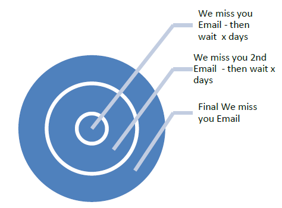
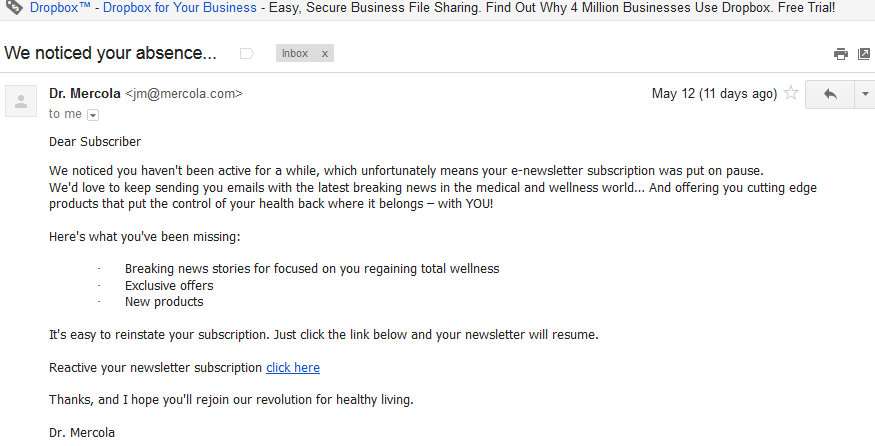
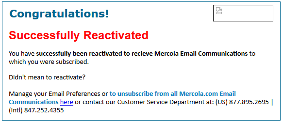

# Best Practices zur Rückgewinnung {#re-engagement}

Einige der Best Practices bei der Implementierung der Zustellbarkeit bestehen darin, eine gesunde Abonnentenbasis zu erhalten und die Zustellbarkeit durch Rückgewinnungsstrategien zu verbessern.

* Die Aufrechterhaltung eines gesunden Abonnentenstamms ist einer der Hauptaspekte für einen guten und konsistenten Versand. Viele Zustellbarkeitsprobleme entstehen durch schlechte Datenpraxis und Wartung.
* Eines der häufigsten Probleme, mit denen Marketing-Experten heutzutage konfrontiert sind, ist die Inaktivität von Abonnenten (auch als „niedrige“ oder „fehlende Interaktion“ bezeichnet), die sich negativ auf den Versand von E-Mails auswirken und einen niedrigen ROI verursachen kann.

>[!NOTE]
>
>Weitere Informationen zu Wiedergewinnungsstrategien und Zustellbarkeitsdiensten von Adobe erhalten sie von Ihrem Zustellbarkeitsberater oder Ihrem Adobe-Vertreter.

## Wie beurteilen ISPs inaktives Verhalten? {#how-do-isps-view-non-engagement-activity-}

Seit Jahren verwenden ISPs Interaktions-Feedback-Metriken ihrer Benutzer, um zu entscheiden, wo Nachrichten platziert werden oder ob sie überhaupt gesendet werden sollen. Benutzer [interaction](/help/engagement.md) besteht aus positivem und negativem Feedback und ISPs überwachen beide konstant. Ohne Interaktion ist vielleicht einer der Hauptfaktoren für negative Interaktion. Aus der Sicht der Zustellbarkeit kann das konsequente Senden von Kampagnen an Benutzer, die keine Interaktion zeigen, auch die Reputation Ihrer IP-Adresse und Ihrer Domänen insgesamt beeinträchtigen.

ISPs wie Gmail, Microsoft und OATH sehen die Interaktion als unerwünschte E-Mail an und beginnen mit der Umleitung von Nachrichten in den Spam-Ordner. Diese Abonnenten besitzen möglicherweise nicht mehr das E-Mail-Konto, was als Spam-Falle &quot;recycelt&quot;verwendet werden kann. Das bedeutet, dass die Adresse einige Zeit lang ungültig war und alle Nachrichten abgelehnt werden. Wenn Ihr Abonnentenverwaltungssystem keine &quot;Hard-bounce&quot;-Adressen entfernt, führt dies wahrscheinlich zu Spam-Fallen, was zu erheblichen Versandproblemen führen kann.

## Wie sollten Sie bei Inaktivität vorgehen? {#how-should-you-approach-inactivity-}

Kunden, die die Adobe-Plattform verwenden, können Inaktivität in ihrer Instanz anzeigen, indem sie die Daten zum Öffnen und Klicken entsprechend dem Segment überprüfen. Da die Nichtinteraktion den Versand behindern kann, besteht der erste Gedanke darin, Abonnenten aus der Datenbank zu entfernen. Dies kann sich jedoch manchmal als falsche Option erweisen. Daher ist eine Rückgewinnungsstrategie (auch als Win-back-Strategie bezeichnet) die beste Empfehlung, die Abonnenten beizubehalten, die an E-Mails interessiert sind, und diejenigen, die keine Aktivität mehr zeigen, schrittweise abzuschaffen.

## Funktionieren Rückgewinnungskampagnen wirklich? {#do-re-engagement-campaigns-really-work-}

Laut einer Studie von Return Path erzielten Rückgewinnungskampagnen eine Öffnungsrate von 12 % verglichen mit einer durchschnittlichen Öffnungsrate von 14 % bei normalen Kampagnen. Obwohl nur 24 % der Abonnenten die Rückgewinnungskampagne gelesen hatten, lasen ca. 45 % von ihnen die darauf folgenden Nachrichten.

## Wie wird eine Rückgewinnungskampagne erstellt? {#how-do-you-create-a-re-engagement-campaign-}

### Phase 1 {#phase-1}

* Der erste Schritt besteht darin, Abonnenten zu identifizieren, die nur sehr wenig bis gar keine Öffnungs- oder Klickaktivität haben, und diese Gruppe entsprechend nach einem bestimmten Zeitrahmen zu segmentieren. Die Faustregel besteht darin, Abonnenten zu überprüfen, die innerhalb der letzten 90 Tage keine E-Mail geöffnet oder angeklickt haben. Dies variiert jedoch je nach Art des Unternehmens (z. B. saisonaler Versand).
* Außerdem sollten Sie bei der Festlegung von Zeitrahmen bedenken, dass ISPs und Anbieter von Blockierungslisten bei der Interaktion von zwischen 1,5 und 1,8 Jahren ausgehen. Verhaltensaktivitäten wie Käufe und Website-Aktivitäten oder andere Touchpoints, z. B. Voreinstellungen während der Anmeldungsphase oder des ersten Kontaktpunkts.

### Phase 2 {#phase-2}

* Sobald ein Segment definiert wurde, besteht der nächste Schritt darin, eine Rückgewinnungskampagne zu erstellen, die den Abonnenten entsprechend den identifizierten Metriken unterstützt. Das Erstellen einer Betreffzeile trägt dazu bei, das Interesse des Abonnenten zu erhöhen. Laut einer Studie von Return Path generieren Betreffzeilen und Inhalte mit dem Status &quot;Wir vermissen Sie&quot; höhere Antwortraten als &quot;Wir wollen Sie zurück&quot;.
* Es kann auch ein Anreiz für die erneute Interaktion mit der E-Mail angeboten werden. Bei der Prüfung von Angeboten mit Rabatten ist es am besten, Beträge in Dollar oder Prozentsätze zu verwenden. Return Path schlägt dies ebenfalls vor, da es höhere Antwortraten erhält. Schließlich ist auch die Durchführung von A/B-Tests zur Überprüfung von Antwort- und Erfolgsraten eine nützliche Option.

### Phase 3 {#phase-3}

Als Nächstes muss die Frequenz der Rückgewinnungskampagne bestimmt werden. Im Gegensatz zu einfachen Bestätigungsnachrichten sollen Rückgewinnungskampagnen die Abonnenten langfristig mit mehreren E-Mails zurückgewinnen. Im Folgenden wird ein Beispiel für die Ermittlung der Frequenz beschrieben.

Abonnenten, die in der Kampagne durch Öffnen oder Anklicken erneut aktiv werden, werden wieder auf die Liste aktiver Abonnenten gesetzt.

### Phase 4 {#phase-4}

* In der nächsten Phase werden Abonnenten identifiziert, die kontinuierlich keine Aktivität zeigen, und der Versand von E-Mails an sie wird schrittweise über einen bestimmten Zeitraum reduziert. Wenn im vergangenen Jahr keine Aktivität stattgefunden hat, ist es gut, die E-Mail-Anmeldung der Abonnenten auf Eis zu legen. Obwohl sie kein Interesse am E-Mail-Inhalt gezeigt haben, besteht immer die Möglichkeit, dass sie ihr Abonnement erneut aktivieren, indem sie eine einmalige Bestätigungskampagne starten.
* Eine Bestätigungskampagne ermöglicht Ihnen, bereits seit langer Zeit inaktive Abonnenten zu fragen, ob sie auf der Abonnentenliste bleiben möchten. Bei der Erstellung der Kampagne sollten Sie einen &quot;Hier klicken&quot;-Link einfügen, damit Empfänger ihre Absicht bestätigen und ihre Adresse verifizieren können. Auf diese Weise kann die Aktion in der Datenbank festgehalten werden. Unten finden Sie ein Beispiel einer Bestätigungs-E-Mail:

   

   Nachdem der Abonnent die Aktion ausgeführt hat, könnten Sie ihm eine Landingpage mit der Bestätigung seiner erneuten Anmeldung anzeigen. Unten finden Sie ein Beispiel für eine Landingpage:

   

## Produktspezifische Ressourcen

**Adobe Campaign**

* [Trackinglogs in Campaign Classic](https://experienceleague.adobe.com/docs/campaign-classic/using/sending-messages/monitoring-deliveries/delivery-dashboard.html#tracking-logs)
* [Trackinglogs in Campaign Standard](https://experienceleague.adobe.com/docs/campaign-standard/using/testing-and-sending/sending-and-tracking-messages/tracking-messages.html#tracking-logs)

**Adobe Customer Journey-Management**

* [Nachrichten-Tracking](https://experienceleague.adobe.com/docs/customer-journey-management/using/reporting/message-tracking.html)
