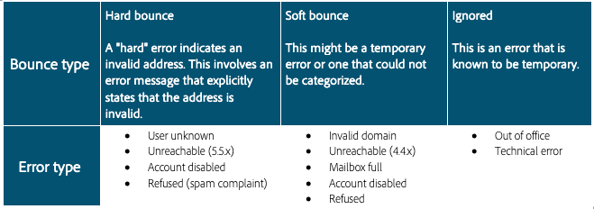

# Bounces

Bounces sind das Ergebnis eines Zustellversuchs und -fehlers, bei dem der ISP Fehlermeldungen zurückgibt. Die Bounce-Verarbeitung ist ein wichtiger Bestandteil der Listenhygiene. Nachdem eine E-Mail mehrmals hintereinander abgewiesen wurde, wird sie durch diesen Prozess markiert und unterdrückt. Die Anzahl und die Art der Bounces, die erforderlich sind, um die Unterdrückung auszulösen, variieren je nach System. Dieser Prozess verhindert, dass Systeme weiterhin ungültige E-Mail-Adressen senden. Bounces gehören zu den wichtigsten Daten, mit denen ISPs die IP-Reputation bestimmen. Es ist sehr wichtig, diese Metrik im Auge zu behalten. &quot;Zugestellt&quot; versus &quot;Bounces&quot; ist wahrscheinlich die gebräuchlichste Art, die Zustellung von Marketing-Nachrichten zu messen: je höher der zugestellte Prozentsatz ist, desto besser.

Hier werden zwei verschiedene Arten von Bounces beschrieben .

## Hardbounces

Hardbounces sind permanente Fehler, die generiert werden, nachdem ein ISP einen Mailing-Versuch an eine Abonnentenadresse als nicht zustellbar eingestuft hat. In Adobe Campaign werden der Quarantäne Hartbounces hinzugefügt, die als nicht zustellbar eingestuft werden. Dies bedeutet, dass ihre Zustellung nicht erneut versucht wird. Es gibt einige Fälle, in denen ein Hardbounce ignoriert wird, wenn die Ursache für den Fehler unbekannt ist.
Hier finden Sie einige gängige Beispiele für Hardbounces:

* Adresse existiert nicht
* Konto deaktiviert
* Fehlerhafte Syntax
* Fehlerhafte Domain

## Softbounces

Softbounces sind vorübergehende Fehler, die ISPs generieren, wenn sie Schwierigkeiten haben, E-Mails zuzustellen. Bei Softbounce-Fehlschlägen wird der Zustellversuch mehrmals wiederholt (mit Abweichungen in Abhängigkeit von der Verwendung benutzerdefinierter oder nativen Versandeinstellungen). Adressen, die ständig einen Softbounce verursachen, werden erst dann in die Quarantäne aufgenommen, wenn die maximale Anzahl von Wiederholungsversuchen erreicht ist (die wiederum von den Einstellungen abhängt). Einige häufige Ursachen für Softbounces sind:

* Postfach voll
* E-Mail-Empfangs-Server ausgefallen
* Probleme mit der Reputation des Absenders

>[!NOTE]
>
>Bounces sind ein wichtiger Indikator für ein Problem, da sie auf eine schlechte Datenquelle (Hardbounce) oder ein Reputationsproblem mit einem ISP (Softbounce) hinweisen können.
>
>Softbounces treten oft im Zuge des E-Mail-Versands auf und sollten die Möglichkeit erhalten, durch Wiederholungen behoben zu werden, bevor sie als echtes Zustellbarkeitsproblem eingestuft werden. Wenn Ihre Softbounce-Rate bei einem einzelnen ISP mehr als 30 Prozent beträgt und nicht innerhalb von 24 Stunden behoben wird, sollten Sie Ihren Zustellbarkeitsberater für Adobe Campaign auf das Problem aufmerksam machen.

## Produktspezifische Ressourcen

**Adobe Campaign Classic**

* [Typen und Ursachen für fehlgeschlagene Sendungen](https://experienceleague.adobe.com/docs/campaign-classic/using/sending-messages/monitoring-deliveries/understanding-delivery-failures.html?lang=de#delivery-failure-types-and-reasons)
* [Bounce-Message-Verwaltung](https://experienceleague.adobe.com/docs/campaign-classic/using/sending-messages/monitoring-deliveries/understanding-delivery-failures.html?lang=de#bounce-mail-management)
* [Report über Unzustellbarkeiten und Bounces](https://experienceleague.adobe.com/docs/campaign-classic/using/reporting/reports-on-deliveries/global-reports.html?lang=de#non-deliverables-and-bounces)

**Adobe Campaign Standard**

* [Typen und Ursachen für fehlgeschlagene Sendungen](https://experienceleague.adobe.com/docs/campaign-standard/using/testing-and-sending/monitoring-messages/understanding-delivery-failures.html?lang=de#delivery-failure-types-and-reasons)
* [Bounce-Message-Qualifizierung](https://experienceleague.adobe.com/docs/campaign-standard/using/testing-and-sending/monitoring-messages/understanding-delivery-failures.html?lang=de#bounce-mail-qualification)
* [Zusammenfassender Report über Bounces](https://experienceleague.adobe.com/docs/campaign-standard/using/reporting/list-of-reports/bounce-summary.html?lang=de#reporting)
