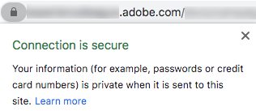

# SSL-Zertifikatanforderungsvorgang

Nachdem Sie eine Domäne zum Senden von E-Mails an die Adobe delegiert haben (siehe [Domain name setup](/help/putting-it-in-practice/ac-domain-name-setup.md)), erstellt und verwendet die Adobe bestimmte Subdomänen für bestimmte Funktionen.

Wenn Sie beispielsweise *email.example.com* auf Adobe zum Senden von E-Mails übertragen haben, erstellt Adobe Subdomänen wie die folgenden:
* *t.email.example.com* - für Tracking-Links
* *m.email.example.com* - für Mirrorseiten
* *res.email.example.com*  - für gehostete Ressourcen (z. B. Bilder)

Es wird empfohlen, **diese Domänen über SSL (HTTPS)** zu sichern. Tatsächlich sind unbesicherte Links (HTTP) anfällig für Abfangen und werden Warnungen in modernen Browsern aufzeigen.

Um SSL-Zertifikate auf diesen Subdomänen zu installieren, müssen Sie eine CSR-Datei anfordern und anschließend SSL-Zertifikate erwerben, damit die Adobe installiert oder erneuert werden kann.

>[!CAUTION]
>
>Bevor Sie ein SSL-Zertifikat installieren, stellen Sie sicher, dass Sie die Voraussetzungen kennen, die auf [dieser Seite](https://experienceleague.adobe.com/docs/control-panel/using/subdomains-and-certificates/renewing-subdomain-certificate.html#installing-ssl-certificate) aufgeführt sind.
>
>Adobe unterstützt nur bis zu 2048-Bit-Zertifikate. 4096-Bit-Zertifikate werden noch nicht unterstützt.

## Glossar

| Begriff | Beschreibung |
|--- |--- |
| CA (Zertifizierungsstelle) | Ein SSL-Zertifikatanbieter, der Organisationen oder Einzelpersonen digitale Zertifikate ausstellt, nachdem sie ihre Identität überprüft haben, z. B. DigiCert, Symantec usw.<ul><li>Eine vertrauenswürdige Zertifizierungsstelle wird in der Regel als Drittanbieter-Zertifizierungsstelle betrachtet, die ein Stammzertifikat ausstellt.</li><li>Wenn das Zertifikat von derselben Organisation/Firma unterzeichnet wurde, die das Zertifikat verwendet, wird es selbst dann als nicht vertrauenswürdige Zertifizierungsstelle klassifiziert, wenn es sich um SSL-Zertifikate wie selbstsignierte Zertifikate handelt.</li></ul> |
| Kettenzertifikat | Ein Zertifikat, das ein Stammzertifikat und ein oder mehrere Zwischenzertifikate enthält, wird als Kettenzertifikat (oder verkettetes Zertifikat) bezeichnet. |
| CSR (Certificate Signing Request) | Ein Block mit kodiertem Text, der einer Zertifizierungsstelle bei der Beantragung eines SSL-Zertifikats übergeben wird. Er wird normalerweise auf dem Server generiert, auf dem das Zertifikat installiert ist. |
| DER (Distinguished Encoding Rules) | Ein Zertifikaterweiterungstyp. Die Erweiterung .der wird für binäre DER-kodierte Zertifikate verwendet. Diese Dateien können auch die Erweiterung .cer oder .crt unterstützen. |
| EV-Zertifikat (Extended Validation) | Ein EV-Zertifikat ist eine neue Art von Zertifikat, das Phishing-Angriffe verhindern soll. Es erfordert eine erweiterte Validierung Ihres Geschäfts und der Person, die das Zertifikat bestellt. |
| Hochsicherheitszertifikat | Zertifikate mit hoher Sicherheit werden von der Zertifizierungsstelle ausgestellt, nachdem die Eigentumsrechte an dem Domänennamen und der gültigen Geschäftsregistrierung überprüft wurden. |
| Vermittelnder Zentralverwahrer | Eine Zertifizierungsstelle für Zwischenbescheinigungen, die in einem Kettenzertifikat enthalten sind. |
| Zwischenzertifikat | Eine Zertifizierungsstelle stellt Zertifikate in Form einer Baumstruktur aus. Das Stammzertifikat ist das oberste Zertifikat der Struktur. Jedes Zertifikat zwischen Ihrem Zertifikat und dem Stammzertifikat wird als Kette- oder Zwischenzertifikat bezeichnet. |
| Niederes Versicherungszertifikat | Ein Zertifikat mit niedriger Sicherheit, auch als domänenvalidiertes Zertifikat bezeichnet, enthält nur den Domänennamen im Zertifikat (und nicht den Namen des Unternehmens/der Organisation). |
| PEM (Privacy Enhanced Mail) | Ein Zertifikat mit der Erweiterung .pem, das ASCII-Daten (Base64) enthält. Solche Bescheinigungen Beginn mit der Zeile &quot; - - - - - - BEGIN CERTIFICATE - - - - -&quot;. |
| Stammzertifikat | Eine Zertifizierungsstelle stellt Zertifikate in Form einer Baumstruktur aus. Das Stammzertifikat ist das oberste Zertifikat der Struktur. |
| SAN (Alternativname des Betreibers) | Die alternativen Namen der Betreffenden sind zusätzliche Hostnamen (Sites, IP-Adressen, allgemeine Namen usw.) , die als Teil eines einzelnen SSL-Zertifikats unterzeichnet werden sollen. |
| Selbstsigniertes Zertifikat | Ein Zertifikat, das von der Person, die es erstellt, und nicht von einer vertrauenswürdigen Zertifizierungsstelle unterzeichnet wird. Selbstsignierte Zertifikate können die gleiche Verschlüsselungsstufe wie ein von einer Zertifizierungsstelle signiertes Zertifikat ermöglichen, es gibt jedoch zwei große Nachteile:<ul><li>Die Verbindung eines Besuchers kann entführt werden, sodass ein Angreifer alle gesendeten Daten Ansicht (wodurch der Zweck der Verschlüsselung der Verbindung zunichte gemacht wird)</li><li> Das Zertifikat kann nicht wie ein vertrauenswürdiges Zertifikat gesperrt werden.</li></ul> |
| SSL (Secure Sockets Layer) | Die Standard-Sicherheitstechnologie zur Einrichtung einer verschlüsselten Verbindung zwischen einem Webserver und einem Browser. |
| Platzhalterzertifikat | Ein Platzhalterzertifikat kann eine unbegrenzte Anzahl von Subdomänen der ersten Ebene mit einem einzigen Domänennamen sichern, z. B. *.adobe.com. |

## Wichtigste Schritte

1. Fordern Sie eine CSR-Datei (Certificate Signing Request) an und geben Sie die erforderlichen Informationen ein (Land, Bundesland, Stadt, Name der Einrichtung, Name der Organisationseinheit usw.) Adobe.
1. Überprüfen Sie, ob die von der Adobe generierte CSR-Datei korrekt ist.
1. Verwenden Sie die CSR-Details, um ein von einer vertrauenswürdigen Zertifizierungsstelle signiertes Zertifikat zu generieren.<!--taking care of asking for using the subjectAltName SSL extension (SAN) if it is for several domain names, and get/purchase the resulting certificate (ideally) in PEM format for Apache server-->
1. Überprüfen Sie, ob das SSL-Zertifikat mit dem CSR übereinstimmt.
1. Geben Sie das SSL-Zertifikat an die Adobe weiter, die es installieren wird.
1. Testen Sie, ob das SSL-Zertifikat für jede gesicherte Subdomäne erfolgreich installiert wurde.
1. Überwachen Sie die Gültigkeitsdauer des SSL-Zertifikats.
1. Aktualisieren Sie eine bestimmte Konfiguration in Adobe Campaign.

## Detaillierter Prozess

### Voraussetzungen

Sie müssen die Domänennamen und Funktionen (Verfolgung, Mirrorseiten, Webapps usw.) identifizieren. zu sichern.
>[!NOTE]
>
>Adobe kann bei der Definition der Domänennamen und der damit verbundenen Funktionen helfen. Weitere Informationen erhalten Sie von Ihrem Adobe Customer Success Manager.

### Schritt 1: CSR-Datei abrufen

Gehen Sie wie folgt vor, um eine CSR-Datei (Certificate Signing Request) zu erhalten.

* Wenn Sie Zugriff auf die [Systemsteuerung](https://experienceleague.adobe.com/docs/control-panel/using/control-panel-home.html?lang=de) haben, befolgen Sie die Anweisungen auf [dieser Seite](https://experienceleague.adobe.com/docs/control-panel/using/subdomains-and-certificates/renewing-subdomain-certificate.html#subdomains-and-certificates), um eine CSR-Datei zu generieren und aus der Systemsteuerung herunterzuladen.

* Erstellen Sie andernfalls ein Support-Ticket unter https://adminconsole.adobe.com/, um eine CSR-Datei von der Kundenunterstützung der Adobe für die erforderliche(n) Subdomäne(n) zu erhalten.

Nachfolgend sind einige bewährte Verfahren aufgeführt:

* Eine Anforderung pro delegierte Subdomäne aufheben.
* Es ist möglich, mehrere Subdomänen zu einer einzigen CSR-Anforderung zu kombinieren, jedoch nur innerhalb derselben Umgebung. In Campaign Classic sind beispielsweise der Marketingserver, der [Mid-Sourcing-Server](https://experienceleague.adobe.com/docs/campaign-classic/using/installing-campaign-classic/additional-configurations/mid-sourcing-server.html) und die [Ausführungsinstanz](https://experienceleague.adobe.com/docs/campaign-classic/using/transactional-messaging/instance-configuration/creating-a-shared-connection.html) drei separate Umgebung.
* Sie müssen eine neue CSR vor einer SSL-Zertifikatverlängerung erhalten. Verwenden Sie keine alte CSR-Datei von vor einem Jahr oder länger.

Sie müssen die folgenden Informationen angeben.

>[!CAUTION]
>
>Alle in den Tabellen angegebenen Felder müssen ausgefüllt werden. Andernfalls kann die CSR-Anforderung nicht verarbeitet werden.

**Informationen, die dem Adobe-Team zur Verfügung gestellt werden müssen:**

| Angaben | Beispielwert | Hinweis |
|--- |--- |--- |
| Clientname | Meine Firma Inc. | Name Ihrer Organisation Dieses Feld wird von der Adobe zur Verfolgung Ihrer Anforderung verwendet (es ist nicht Teil des CSR/SSL-Zertifikats). |
| Adobe Campaign-Umgebung-URL | https://client-mid-prod1.campaign.adobe.com | URL der Adobe Campaign-Instanz. |
| Allgemeiner Name [CN] | t.subdomain.customer.com | Hierbei kann es sich um eine beliebige der relevanten Domänen handeln, üblicherweise jedoch um die Verfolgungsdomäne. |
| Alternativname des Betreibers [SAN] | t.subdomain.customer.com | Stellen Sie sicher, dass Verfolgungs-Subdomäne als SAN einbezogen wird. |
| Alternativname des Betreibers [SAN] | m.subdomain.customer.com |
| Alternativname des Betreibers [SAN] | res.subdomain.customer.com |

**Informationen, die Ihr internes IT/SSL-Team bereitstellt:**

| Angaben | Beispielwert | Hinweis |
|--- |--- |--- |
| Land [C] | US | Dies muss ein aus zwei Buchstaben bestehender Code sein. Rufen Sie die vollständige Liste [hier](https://www.ssl.com/csrs/country_codes/) auf. *Hinweis: Für Großbritannien verwenden Sie GB (nicht UK).* |
| Bundesland (oder Bundesland) [ST] | Illinois | Falls zutreffend. Der Wert muss ein vollständiger Name sein, nicht abgekürzt. |
| Stadt-/Ortsname [L] | Chicago |
| Name der Organisation [O] | ACME |
| Name der Unternehmenseinheit [OU] | IT |

>[!NOTE]
>
>Ersetzen Sie &quot;subdomain.customer.com&quot;durch Ihre delegierte Subdomäne und die anderen Beispielwerte durch die entsprechenden Werte.

### Schritt 2: CSR-Datei überprüfen

Nachdem Sie Ihre Anforderung mit den entsprechenden Informationen übermittelt haben, erstellt Adobe eine CSR-Datei (Certificate Signing Request) und stellt diese bereit.

Der Text in der resultierenden CSR-Datei muss mit **&quot;—BEGIN CERTIFICATE REQUEST—&quot;** Beginn werden.

Gehen Sie wie folgt vor, nachdem Sie die CSR-Datei von der Adobe erhalten haben:

1. Kopieren Sie den Text der CSR-Datei und fügen Sie ihn in einen Online-Decoder wie https://www.sslshopper.com/csr-decoder.html, <!--https://www.certlogik.com/decoder/,--> oder https://www.entrust.net/ssl-technical/csr-viewer.cfm ein.
Alternativ können Sie den Befehl *OpenSSL* lokal auf einem Linux-Computer verwenden. Weitere Informationen hierzu finden Sie auf [dieser externen Seite](https://www.question-defense.com/2009/09/22/use-openssl-to-verify-the-contents-of-a-csr-before-submitting-for-a-ssl-certificate).
1. Vergewissern Sie sich, dass alle Prüfungen erfolgreich sind.
1. Überprüfen Sie, ob die richtigen Parameter und Domänennamen enthalten sind.
1. Vergewissern Sie sich, dass alle anderen Daten mit den Angaben übereinstimmen, die Sie beim Senden der Anforderung angegeben haben.

### Schritt 3: Generieren des SSL-Zertifikats

Sobald die CSR-Datei bereitgestellt wurde, müssen Sie ein SSL-Zertifikat für die entsprechenden Domänen mit der CSR-Datei erwerben und erstellen.

* Das SSL-Zertifikat:
   * muss im Apache PEM-Format vorliegen;
   * darf nicht länger als 2048 Bit sein;
   * müssen von einer gültigen Zertifizierungsstelle (Zertifizierungsstelle) unterzeichnet werden;
   * muss alle SANs (Subject Alternative Names) enthalten, wie in der CSR-Datei erwähnt.
* Wenn ein oder mehrere Zwischenzertifikate vorhanden sind, müssen Sie das Stammzertifikat und alle Zwischenzertifikate für die Adobe bereitstellen.
* Sie können eine beliebige Gültigkeitsdauer des Zertifikats festlegen. Adobe empfiehlt jedoch, diese ausreichend lange (z. B. zwei Jahre) auszuwählen.

>[!NOTE]
>
>Wenn Sie Ihre eigenen internen Tools oder ein von einer Zertifizierungsstelle bereitgestelltes Portal zum Anfordern des Zertifikats verwenden, stellen Sie sicher, dass Sie die gleichen Details verwenden, die in der CSR-Anforderung angegeben sind, um Verzögerungen oder Diskrepanzen beim Zertifikatgenerierungsprozess zu vermeiden.

### Schritt 4: SSL-Zertifikat überprüfen

Nachdem das SSL-Zertifikat generiert wurde, müssen Sie es überprüfen, bevor Sie es an die Adobe senden. Gehen Sie dazu wie folgt vor:

1. Vergewissern Sie sich, dass das Zertifikat über die Erweiterung .pem verfügt. Ist dies nicht der Fall, konvertieren Sie es in das PEM-Format. Sie können die Konvertierung mit *OpenSSL* durchführen.
1. Vergewissern Sie sich, dass das Zertifikat mit **&quot;—BEGIN CERTIFICATE—&quot;** Beginn.
1. Kopieren Sie den Zertifikatstext in einen Online-Decoder, z. B. https://www.sslshopper.com/certificate-decoder.html oder https://www.entrust.net/ssl-technical/csr-viewer.cfm.
Alternativ können Sie den Befehl *OpenSSL* lokal auf einem Linux-Computer verwenden. Weitere Informationen hierzu finden Sie auf [dieser externen Seite](https://www.shellhacks.com/decode-ssl-certificate/).
1. Stellen Sie sicher, dass das Zertifikat ordnungsgemäß aufgelöst wird, einschließlich des Common Name-, SAN-, Issuer- und Gültigkeitszeitraums.
1. Wenn die SSL-Zertifikatüberprüfung erfolgreich ist, überprüfen Sie anhand von [dieser Website](https://www.sslshopper.com/certificate-key-matcher.html), ob das Zertifikat mit der CSR übereinstimmt: Wählen Sie **Überprüfen Sie, ob eine CSR- und eine Zertifikatübereinstimmung** vorliegt, und geben Sie Ihr Zertifikat und Ihre CSR-Datei in die entsprechenden Felder ein. Sie sollten übereinstimmen.

### Schritt 5: SSL-Zertifikatinstallation anfordern

* Wenn Sie Zugriff auf die [Systemsteuerung](https://experienceleague.adobe.com/docs/control-panel/using/control-panel-home.html) haben, befolgen Sie die Anweisungen auf [dieser Seite](https://experienceleague.adobe.com/docs/control-panel/using/subdomains-and-certificates/renewing-subdomain-certificate.html#installing-ssl-certificate), um das Zertifikat in die Systemsteuerung hochzuladen.

* Erstellen Sie andernfalls ein weiteres Support-Ticket über https://adminconsole.adobe.com/, um eine Adobe zur Installation des Zertifikats auf dem/den Adoben-Server(n) anzufordern.

Sie müssen Folgendes bereitstellen:

* Die Zertifikatsdatei, das Stammzertifikat und alle (mit dem Ticket verbundenen) Zwischenzertifikate, vorzugsweise im Apache PEM-Format.
* Die Nummer des vorherigen Support-Tickets, das für die CSR erhöht wurde.
* Dieselben Daten, die für das CSR-Ticket bereitgestellt wurden (einschließlich Allgemeiner Name, Instanz-URL, Bundesland, Stadt/Ort, Name der Organisation, Name der Einheit des Unternehmens usw.).

### Schritt 6: Installieren des SSL-Zertifikats testen

Nachdem das SSL-Zertifikat installiert und von der Adobe Customer Care bestätigt wurde, stellen Sie sicher, dass es für alle URLs erfolgreich installiert wurde.

Führen Sie die unten stehenden Tests durch, bevor Sie das SSL-Installationsticket schließen. Achten Sie außerdem darauf, eine bestimmte Konfiguration entsprechend den Anweisungen in [diesem Abschnitt](#update-configuration) zu aktualisieren.

Navigieren Sie zu den folgenden URLs in Ihrem Browser (ersetzen Sie &quot;subdomain.customer.com&quot;durch Ihre Subdomäne):

* https://subdomain.customer.com/r/test (nur für [Webanwendungen](https://experienceleague.adobe.com/docs/campaign-classic/using/designing-content/web-applications/about-web-applications.html)-Subdomänen - gilt nicht für E-Mail-Subdomänen)
* https://t.subdomain.customer.com/r/test
* https://m.subdomain.customer.com/r/test
* https://res.subdomain.customer.com/r/test

Bei erfolgreichem Ergebnis erhalten Sie Informationen zur Umgebung, und die Adressleiste in der URL gibt an, dass die Verbindung sicher ist. Sie können beispielsweise folgende Meldung in Google Chrome anzeigen:

Wenn das SSL-Zertifikat nicht ordnungsgemäß installiert ist, wird die folgende Warnung angezeigt:

### Schritt 7: Überprüfen der Gültigkeitsdauer des Zertifikats

Sie können die Gültigkeitsdauer des Zertifikats in Ihrem Browser überprüfen. Klicken Sie in Google Chrome beispielsweise auf **Secure** > **Certificate**.

Es liegt in Ihrer Verantwortung, die Gültigkeitsdauer zu überprüfen. Adobe empfiehlt die Implementierung eines Prozesses zur Überwachung des Zertifikatsablaufs. Erfahren Sie mehr darüber, was passiert, wenn Ihr SSL-Zertifikat abläuft, in [diesem Artikel](https://www.thesslstore.com/blog/what-happens-when-your-ssl-certificate-expires/).

* Erstellen Sie ein Support-Ticket, um ein aktualisiertes Zertifikat mindestens zwei Wochen vor dem Ablaufdatum des Zertifikats anzufordern. Sie müssen keine zusätzliche CSR-Datei anfordern, es sei denn, die CSR-Details wurden geändert.

* Wenn Sie Zugriff auf das [Systemsteuerung](https://experienceleague.adobe.com/docs/control-panel/using/control-panel-home.html) haben und Ihre Umgebung von Adobe in einer AWS-Umgebung gehostet wird, können Sie das Zertifikat über die Systemsteuerung verlängern, bevor es abläuft. Weiterführende Informationen finden Sie in diesem [Abschnitt](https://experienceleague.adobe.com/docs/control-panel/using/subdomains-and-certificates/monitoring-ssl-certificates.html#monitoring-certificates).

### Schritt 8: Aktualisieren einer bestimmten Konfiguration {#update-configuration}

Nachdem Sie sich vergewissert haben, dass die angeforderten SSL-Zertifikate ordnungsgemäß installiert sind, können Sie alle Verweise im Adobe Campaign von HTTP auf HTTPS aktualisieren.

>[!NOTE]
>
>Campaign Classic: Die zu aktualisierenden URLs befinden sich hauptsächlich im [Bereitstellungsassistenten](https://experienceleague.adobe.com/docs/campaign-classic/using/installing-campaign-classic/initial-configuration/deploying-an-instance.html#deployment-wizard) und in den [Externen Konti](https://experienceleague.adobe.com/docs/campaign-classic/using/installing-campaign-classic/additional-configurations/external-accounts.html#installing-campaign-classic) (Domänen für Verfolgung, Mirrorseite und öffentliche Ressource). Campaign Standard: Siehe [Branding configuration](https://experienceleague.adobe.com/docs/campaign-standard/using/administrating/application-settings/branding.html#about-brand-identity).

Nach der Aktualisierung der Konfigurationen werden neue E-Mails mit HTTPS-URLs statt mit HTTP gesendet. Um zu überprüfen, ob die URLs nun sicher sind, können Sie schnell die folgenden Tests durchführen:

* Laden Sie ein Bild aus dem Adobe Campaign hoch. Nach dem Hochladen des Bildes sollte die zurückgegebene URL HTTPS lauten.
* Erstellen Sie einen Test-E-Mail-Versand, einschließlich eines Links zu Mirrorseiten, einigen Bildern, Text und einem Link zur Abmeldung. Senden Sie die E-Mail an eine externe E-Mail-ID (z. B. Ihre Gmail-Adresse). Öffnen Sie nach dem Erhalt die E-Mail und stellen Sie sicher, dass alle Links in der E-Mail korrekt in ihrem HTTPS-Formular (nicht HTTP) geöffnet werden, ohne dass SSL-Zertifikatwarnungen oder -Fehler auftreten.

## Produktspezifische Ressourcen

**Campaign Classic**

* [Systemsteuerung: Hinzufügen von SSL-Zertifikaten (Tutorial)](https://experienceleague.adobe.com/docs/campaign-classic-learn/control-panel/subdomains-and-certificates/adding-ssl-certificates.html)  - Erfahren Sie, wie Sie SSL-Zertifikate hinzufügen, um Ihre Subdomänen zu schützen.

**Campaign Standard**

* [Systemsteuerung: Hinzufügen von SSL-Zertifikaten (Tutorial)](https://experienceleague.adobe.com/docs/campaign-standard-learn/control-panel/subdomains-and-certificates/adding-ssl-certificates.html)  - Erfahren Sie, wie Sie SSL-Zertifikate hinzufügen, um Ihre Subdomänen zu schützen.