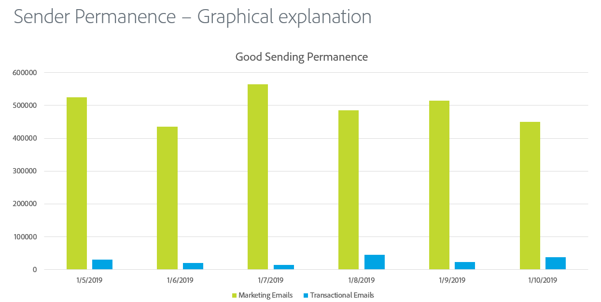
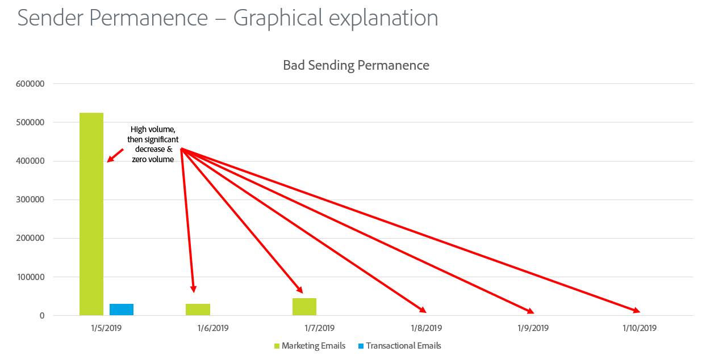
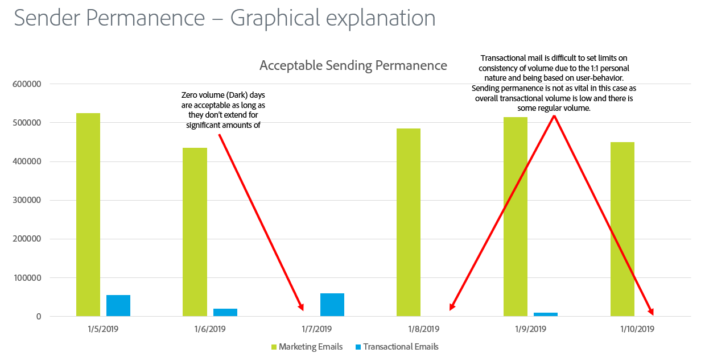

# Absenderpermanenz

Die Entsendung von Dauerhaftigkeit ist der Prozess der Schaffung eines konsistenten Entsendungsvolumens und einer konsistenten Strategie, um den Ruf des ISP zu erhalten. Aus den folgenden Gründen ist eine permanente Absender-Funktion wichtig:

* Spammers werden normalerweise &quot;IP-Adressenhop&quot;genannt, d. h., sie verschieben den Traffic über viele IP-Adressen hinweg, um Reputationsfehler zu vermeiden.
* Konsistenz ist der Schlüssel zum Nachweis, dass der Absender seriös ist und nicht versucht, Reputationsprobleme zu umgehen, die auf schlechte Versandmethoden zurückzuführen sind.
* Die Beibehaltung dieser konsistenten Strategien über einen langen Zeitraum hinweg ist erforderlich, bevor einige ISPs die seriöse Absender überhaupt in Betracht ziehen.

**Hier einige Beispiele:**

