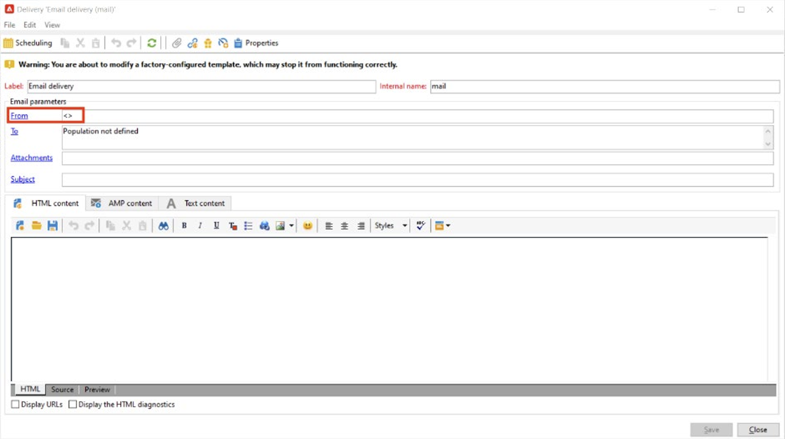
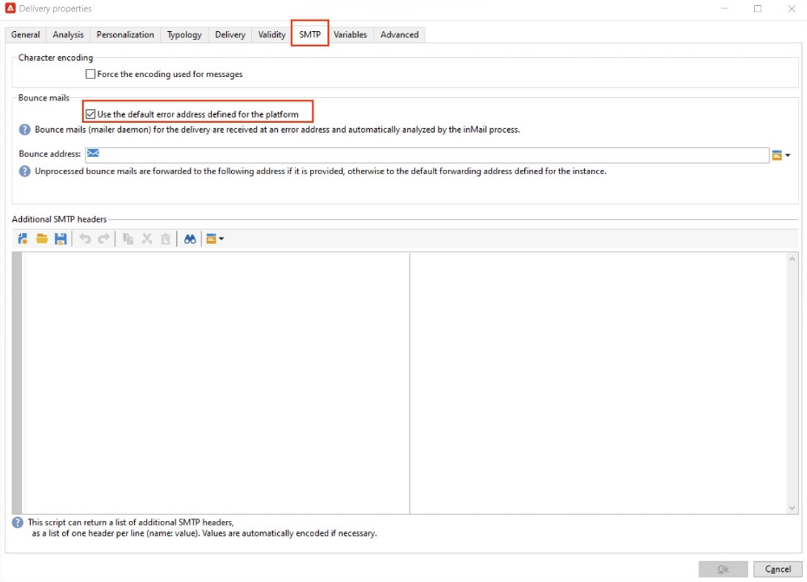
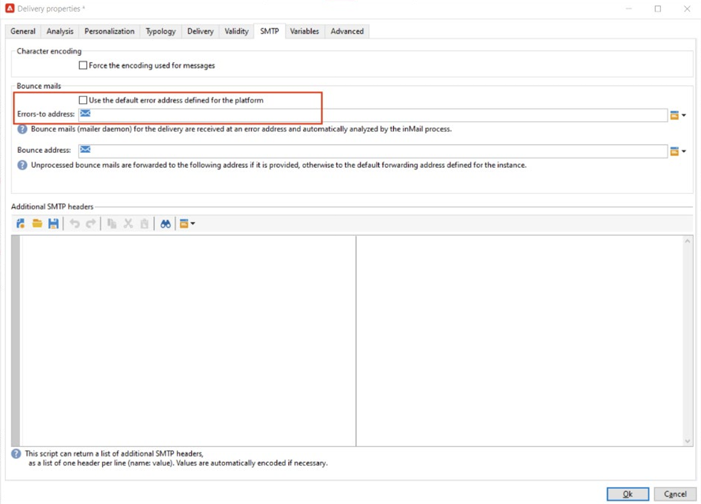

# Implementierung [!DNL Domain-based Message Authentication, Reporting and Conformance] (DMARC)

Dieses Dokument dient dazu, dem Leser weitere Informationen zur E-Mail-Authentifizierungsmethode DMARC bereitzustellen. Durch die Erläuterung der Funktionsweise von DMARC und der verschiedenen Richtlinienoptionen werden die Auswirkungen von DMARC auf die E-Mail-Zustellbarkeit besser verstanden.

## Was ist DMARC? {#about}

Domänenbasierte Nachrichtenauthentifizierung, Berichterstellung und Konformität ist eine E-Mail-Authentifizierungsmethode, mit der Domain-Inhaber ihre Domäne vor nicht autorisierter Verwendung schützen können. DMARC bietet außerdem Feedback zum E-Mail-Authentifizierungsstatus und ermöglicht es Absendern, zu steuern, was mit E-Mails mit fehlgeschlagener Authentifizierung passiert. Dies umfasst Optionen zum Überwachen, Quarantänen oder Ablehnen von E-Mails, abhängig davon, welche DMARC-Richtlinie implementiert wurde.

DMARC verfügt über drei Richtlinienoptionen:

* **Monitor (p=none):** Weist den Postfachanbieter/ISP an, alles zu tun, was er normalerweise für die Nachricht tun würde.
* **Quarantäne (p=quarantine):** Weist den Postfachanbieter/ISP an, E-Mails zu senden, die DMARC nicht an den Spam- oder Junk-Ordner des Empfängers übergeben.
* **Ablehnen (p=reject):** Weist den Postfachanbieter/ISP an, E-Mails zu blockieren, die DMARC nicht übergeben, was zu einem Absprung führt.

## Wie wirkt DMARC? {#how}

SPF und DKIM werden beide verwendet, um eine E-Mail mit einer Domäne zu verknüpfen und um E-Mails zu authentifizieren. DMARC geht noch einen Schritt weiter und hilft, das Spoofing zu verhindern, indem die von DKIM und SPF überprüfte Domain abgeglichen wird. Um DMARC zu übergeben, muss eine Nachricht SPF oder DKIM übergeben. Wenn beide diese Authentifizierungsfehler beheben, schlägt DMARC fehl und die E-Mail wird gemäß Ihrer ausgewählten DMARC-Richtlinie zugestellt.

>[!NOTE]
>
>DMARC erfordert die Ausrichtung zwischen der Adresse &quot;Von&quot;und der Adresse &quot;Return-Path&quot;.

## Warum sollte DMARC implementiert werden? {#why}

DMARC ist optional. Obwohl es nicht erforderlich ist, ist es kostenlos und ermöglicht E-Mail-Empfängern, die Authentifizierung von E-Mails einfach zu identifizieren, was den Versand potenziell verbessern kann. Einer der Hauptvorteile von DMARC besteht darin, dass es Berichte darüber anbietet, welche Nachrichten SPF und/oder DKIM fehlschlagen. Außerdem erhalten die Absender eine gewisse Kontrolle darüber, was mit E-Mails passiert, die keine dieser Authentifizierungsmethoden bestehen. Durch die DMARC-Berichterstellung erhalten Absender einen Überblick darüber, welche Nachrichten DMARC-fehlschlagen, sodass Schritte unternommen werden können, um weitere Fehler zu beheben.

>[!NOTE]
>
>Wenn Sie BIMI implementieren möchten, ist eine p=quarantine oder p=reject DMARC-Richtlinie erforderlich.

## Best Practices für die Implementierung von DMARC {#best-practice}

Da DMARC optional ist, wird es nicht standardmäßig auf einer ESP-Plattform konfiguriert. Für Ihre Domain muss ein DMARC-Eintrag im DNS erstellt werden, damit er funktioniert. Darüber hinaus ist eine von Ihnen ausgewählte E-Mail-Adresse erforderlich, um anzugeben, wohin DMARC-Berichte in Ihrem Unternehmen untergebracht werden sollen. Als Best Practice wird empfohlen, die DMARC-Implementierung langsam einzuführen, indem Sie Ihre DMARC-Richtlinie von p=none auf p=quarantine eskalieren und p=reject, sobald DMARC die potenziellen Auswirkungen von DMARC erkennt.

1. Analysieren Sie das Feedback, das Sie erhalten und verwenden (p=none), das den Empfänger anweist, keine Aktionen für Nachrichten durchzuführen, die die Authentifizierung nicht befolgen, aber trotzdem E-Mail-Berichte an den Absender senden. Überprüfen und beheben Sie außerdem Probleme mit SPF/DKIM, wenn die Authentifizierung für legitime Nachrichten fehlschlägt.
1. Bestimmen Sie, ob SPF und DKIM abgestimmt sind und übergeben Sie die Authentifizierung für alle legitimen E-Mails und verschieben Sie dann die Richtlinie auf (p=quarantine), wodurch der E-Mail-Empfangs-Server angewiesen wird, E-Mails unter Quarantäne zu stellen, die die Authentifizierung fehlschlagen (im Allgemeinen bedeutet dies, dass diese Nachrichten im Spam-Ordner abgelegt werden).
1. Richtlinie anpassen auf (p=reject). Die p=-Zurückweisungsrichtlinie weist den Empfänger an, jede E-Mail für die Domain, bei der die Authentifizierung fehlschlägt, vollständig zu verweigern (Bounce). Wenn diese Richtlinie aktiviert ist, haben nur E-Mails, die zu 100 % von Ihrer Domäne authentifiziert wurden, sogar die Möglichkeit, die Posteingangsplatzierung durchzuführen.

   >[!NOTE]
   >
   >Verwenden Sie diese Richtlinie mit Vorsicht und legen Sie fest, ob sie für Ihre Organisation geeignet ist.

## DMARC-Berichterstellung {#reporting}

DMARC bietet die Möglichkeit, Berichte zu E-Mails zu erhalten, die SPF/DKIM nicht unterstützen. Es gibt zwei verschiedene Berichte, die von ISP-Dienstern im Rahmen des Authentifizierungsprozesses generiert werden und die Absender über die RUA/RUF-Tags in ihrer DMARC-Richtlinie empfangen können:

* **Aggregat-Berichte (RUA):** Enthält keine personenbezogenen Daten (personenbezogene Daten), die DSGVO-konform sind.
* **Kriminalitätsberichte (RUF):** Enthält E-Mail-Adressen, die DSGVO-konform sind. Vor der Verwendung sollten Sie intern überprüfen, wie mit Informationen verfahren wird, die DSGVO-konform sein müssen.

Diese Berichte dienen hauptsächlich dazu, einen Überblick über E-Mails zu erhalten, die versucht werden, Nachrichten zu spoofing zu senden. Dies sind hochtechnische Berichte, die am besten mit einem Tool von Drittanbietern aufbereitet werden. Einige auf DMARC-Überwachung spezialisierte Unternehmen sind:

* [ValiMail](https://www.valimail.com/products/#automated-delivery)
* [Agari](https://www.agari.com/)
* [Dmarcian](https://dmarcian.com/)
* [Proofpoint](https://www.proofpoint.com/us)

### Beispiel für einen DMARC-Datensatz {#example}

```
v=DMARC1; p=reject; fo=1; rua=mailto:dmarc_rua@emaildefense.proofpoint.com;ruf=mailto:dmarc_ruf@emaildefense.proofpoint.co
```

## DMARC-Tags und ihre Aufgaben {#tags}

DMARC-Datensätze verfügen über mehrere Komponenten, die DMARC-Tags genannt werden. Jedes Tag verfügt über einen Wert, der einen bestimmten Aspekt von DMARC angibt.

| Tag-Name | Erforderlich/Optional | Funktion | Beispiel | Standardwert |
|  ---  |  ---  |  ---  |  ---  |  ---  |
| v | Erforderlich | Dieses DMARC-Tag gibt die Version an. Derzeit gibt es nur eine Version. Daher hat diese den festen Wert v=DMARC1 | V=DMARC1 DMARC1 | DMARC1 |
| p | Erforderlich | Zeigt die ausgewählte DMARC-Richtlinie an und weist den Empfänger an, E-Mails zu melden, in Quarantäne zu stellen oder abzulehnen, die bei Authentifizierungsprüfungen fehlschlagen. | p=none, quarantine or reject | – |
| fo | Optional | Ermöglicht es dem Domäneninhaber, Berichtsoptionen anzugeben. | 0: Bericht erstellen, wenn alles fehlschlägt<br/>1: Bericht erstellen, wenn alles fehlschlägt<br/>d: Bericht erstellen, wenn DKIM fehlschlägt<br/>s: Bericht erstellen, wenn SPF fehlschlägt | 1 (empfohlen für DMARC-Berichte) |
| pct | Optional | Teilt den Prozentsatz der Nachrichten mit, die gefiltert werden sollen. | pct=20 | 100 |
| rua | Optional (empfohlen) | Gibt an, wo aggregierte Berichte bereitgestellt werden. | `rua=mailto:aggrep@example.com` | – |
| ruf | Optional (empfohlen) | Gibt an, wo forensische Berichte bereitgestellt werden. | `ruf=mailto:authfail@example.com` | – |
| sp | Optional | Gibt die DMARC-Richtlinie für Subdomänen der übergeordneten Domäne an. | sp=reject | – |
| adkim | Optional | Kann entweder streng (s) oder entspannt (r) sein. Eine verzögerte Ausrichtung bedeutet, dass die in der DKIM-Signatur verwendete Domain eine Subdomäne der &quot;Von&quot;-Adresse sein kann. Eine strikte Ausrichtung bedeutet, dass die in der DKIM-Signatur verwendete Domäne exakt mit der in der von-Adresse verwendeten Domäne übereinstimmen muss. | adkim=r | r |
| aspf | Optional | Kann entweder streng (s) oder entspannt (r) sein. Eine verzögerte Ausrichtung bedeutet, dass die Domäne &quot;ReturnPath&quot;eine Subdomäne der &quot;From Address&quot;sein kann. Eine strikte Ausrichtung bedeutet, dass die Domäne &quot;Return-Path&quot;exakt mit der Absenderadresse übereinstimmen muss. | aspf=r | r |

## DMARC und Adobe Campaign {#campaign}

Ein häufiger Grund für DMARC-Fehler ist die Fehlausrichtung zwischen der Adresse &quot;Von&quot;und &quot;Fehler-To&quot;oder &quot;Rückkehrpfad&quot;. Um dies zu vermeiden, wird bei der Einrichtung von DMARC empfohlen, die Adresseinstellungen &quot;Von&quot;und &quot;Fehler-To&quot;in den Versandvorlagen zu überprüfen.

1. Überprüfen Sie in Ihrer Versandvorlage, welche Adresse derzeit als Ihre &quot;Von&quot;-Adresse festgelegt ist.

   

1. Wählen Sie hier &quot;Eigenschaften&quot;aus, um Ihre Versandvorlage weiter zu bearbeiten. Wählen Sie in diesem Fenster SMTP aus und deaktivieren Sie, falls ausgewählt, die Option &quot;Standardfehleradresse für die Plattform verwenden&quot;. Versandvorlagen in Adobe Campaign aktivieren Sie dieses Kontrollkästchen standardmäßig. Die Standard-Fehleradresse ist möglicherweise nicht die Adresse, die der Absenderadresse in dieser Versandvorlage zugeordnet ist.

   

1. Wenn dieses Kontrollkästchen deaktiviert ist, wird ein Textfeld angezeigt, in das Sie eine eindeutige Fehleradresse eingeben können, die dieselbe Domäne wie in &quot;Von Adresse&quot;festgelegt verwendet.

   

Sobald diese Änderungen gespeichert sind, können Sie mit Ihrer DMARC-Implementierung mit der richtigen Domänenausrichtung fortfahren.

## Nützliche Links {#links}

* [DMARC.org](https://dmarc.org/){target="_blank"}
* [M3AAWG-E-Mail-Authentifizierung](https://www.m3aawg.org/sites/default/files/document/M3AAWG_Email_Authentication_Update-2015.pdf){target="_blank"}
