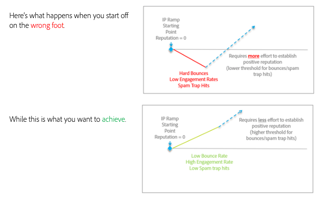

# So wechseln Sie beim reibungslosen Transition von E-Mail-Plattformen

Beim Verschieben von E-Mail-Dienstleistern (ESPs) ist es nicht möglich, auch Ihre bestehenden, etablierten IP-Adressen Transition. Es ist wichtig, dass Sie Best Practices für die Entwicklung eines positiven Rufs beim Neustarten befolgen. Da die neuen IP-Adressen, die Sie verwenden werden, noch nicht bekannt sind, können ISPs der E-Mail, die von ihnen stammt, nicht voll vertrauen und müssen vorsichtig sein, was sie für die Zustellung an ihre Kunden zulassen.

Ein positiver Ruf ist ein Prozess. Aber sobald sie eingerichtet ist, haben kleine negative Indikatoren weniger Einfluss auf Sie und Ihren E-Mail-Versand.

Die Wartezeit zum Aufwärmen Ihrer IP-Adressen und Domänen kann unterschiedlich sein, aber für typische Absender ist es üblich, bis zu acht Wochen lang einen Ruf bei den meisten Tier-1-ISPs (Gmail, Microsoft, Verizon/Yahoo/AOL usw.) zu etablieren.

In den nächsten Abschnitten werden wir einige Schlüsselbereiche untersuchen, auf die wir uns auf die korrekte Einführung an Bord konzentrieren sollten:

1. [Infrastruktur](/help/transition-process/infrastructure.md)
2. [Targeting-Kriterien](/help/transition-process/targeting-criteria.md)
3. [ISP-spezifische Aspekte bei der IP-Erwärmung](/help/transition-process/isp-specific-considerations-during-ip-warming.md)
4. [Volumen](/help/transition-process/volume.md)
