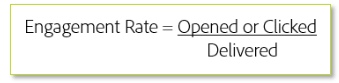

# Targeting-Kriterien

Beim Versand von neuem Traffic sollten Sie nur die Zielgruppe Ihrer am meisten engagierten Benutzer während der ersten Phase der IP-Erwärmung vornehmen. Dies hilft, einen positiven Ruf von get-go zu etablieren, um effektiv Vertrauen aufzubauen, bevor Sie Ihre weniger engagierten Audiencen einführen. Hier ist eine grundlegende Formel für Interaktionen:

In der Regel basiert eine Interaktionsrate auf einem bestimmten Zeitraum. Diese Metrik kann drastisch variieren, je nachdem, ob die Formel auf einer Gesamtebene oder für bestimmte Mailing-Typen oder Kampagnen angewendet wird. Die spezifischen Targeting-Kriterien müssen durch die Zusammenarbeit mit Ihrem Berater für die Adobe bereitgestellt werden, da jeder Absender und ISP variiert und in der Regel einen angepassten Plan benötigt.

## Produktspezifische Ressourcen

**Analytics**

* [Erhöhung der Interaktions- und Retentionsraten (Tutorial)](https://experienceleague.adobe.com/docs/analytics-learn/tutorials/mobile-app-analytics/measuring-mobile-analytics/how-to-increase-engagement-and-retention-rates.html?lang=en#mobile-app-analytics):  *Identifizieren Sie mit Cohorts belegte Audiencen anhand ihres Verhaltens und kennen Sie die zugrunde liegenden Ursachen, die die Stickiness in Ihren mobilen Apps fördern. Verwenden Sie Data Science-Algorithmen in Segment-IQ, um die Unterschiede und Ähnlichkeiten zwischen Segmenten zu überblicken.*

**Campaign Standard**

* [AI-basierte E-Mails: Bewertung der voraussichtlichen Interaktion](https://experienceleague.adobe.com/docs/campaign-standard/using/testing-and-sending/preparing-and-testing-messages/predictive.html#predictive-scoring)

